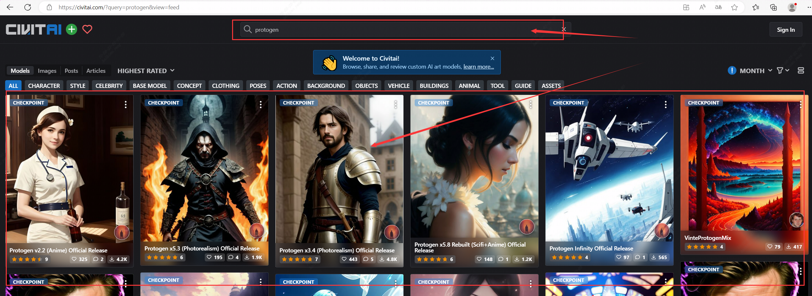

**Stable Diffusion Webui 扩展Civitai助手，可用于更轻松的管理和使用Civitai模型**

Civitai助手支持功能：

- 扫描所有Civitai模型，从Civitai下载模型信息和预览图
- 通过Civitai模型页面url，连接本地模型和civitai模型信息
- 通过Civitai模型页面url，下载模型(包含信息和预览图)到SD目录或子目录。
- 下载支持断点续传
- 批发检验地模型，在Civitai上的新版本
- 直接下载新版本模型到SD模型目录内(包含信息和预览图)

具体的安装及使用步骤如下

### 一、安装Civitai Helper

进入已部署好的Stable Diffusion WebUI界面（具体部署方式：[如何一键部署安装Stable Diffusion WebUI](https://zhuanlan.zhihu.com/p/631220464)），

点击扩展 → 从URL安装 → 拉取URL仓库安装Civitai Helper→安装Install

安装成功，可以在扩展Extensions的installed中看到Civitai Helper

### 二、使用Civitai Helper下载模型

通过Civitai-Helper进行相关模型下载与使用.

第1步，进入[[Civitai官网](https://civitai.com/)]并选择自己的模型，复制模型详情页URL；【这里选择Protogen3.4】

第2步，成功获取模型信息会在终端中输出相关信息如下：

第3步，下载模型终端输出相关信息如下：

​		下载中：

​		下载完成：

重启webui，进入即可选择下载后的模型，用于生成

### webui界面各参数含义：

具体参数说明：

- **采样方法 (Sampler)**：这个参数允许您选择用于生成图像的采样方法。默认情况下，该参数设置为“Eulea”，但您也可以选择“DPM++”后面的新加入选项，这个会比默认的生成的图片细节内容更加丰富些。
- **迭代步数（Sampling steps）**: 这个参数允许您指定图像生成的迭代次数。较多的迭代次数可能会导致更好的图像质量，但也需要更长的时间来完成生成，默认50起步。
- **宽度&高度**：这个参数允许您指定图片生成的高度和宽度。较大的高度宽度需要更多的显存计算资源，这里默认512*512即可，需要图片放大我们可以去更多（send to extras）模块用放大算法进行图片放大。
- **生成批次（Batch count）**：此参数允许您用指定模型将为每个生成的图像运行的最大迭代次数。增加这个值多次生成图片但生成的时间也会更长（**有多图需要建议减少图片生成的批次改为增加单次生成图片的数量参数即可**）。
- **每批数量（Batch size）**：此参数允许您指定一次可以生成的最大图像数量。如果您的系统资源有限，并且需要以较小的批量生成映像，那么这可能很有用。
- **提示词相关性(CFG Scale)**：此参数可以变更图像与提示符的一致程度（增加这个值将导致图像更接近你的提示,但过高会让图像色彩过于饱和,数值越小AI绘图发挥的自我空间越大越有可能产生有创意的结果（默认为7）。
- **种子数（Seed）**: 此参数允许您指定一个随机种子，将用于初始化图像生成过程。相同的种子值每次都会产生相同的图像集，这对于再现性和一致性很有用。如果将种子值保留为-1，则每次运行文本-图像特性时将生成一个随机种子。
- **优化面部（Restore faces)**:优绘制面部图像可勾选，头像是近角时勾选貌似容易过度拟合出现虚化，适合在远角时勾选该选项。
- **可平铺(Tiling)**：用于生成一个可以平铺的图像。
- **Highres. fix**:使用两个步骤的过程进行生成，以较小的分辨率创建图像，然后在不改变构图的情况下改进其中的细节，选择该部分会有两个新的参数**Scale latent**在潜空间中对图像进行缩放。另一种方法是从潜在的表象中产生完整的图像，将其升级，然后将其移回潜在的空间。**Denoising strength** 决定算法对图像内容的保留程度。在0处，什么都不会改变，而在1处，你会得到一个不相关的图像；

### ControlNet参数介绍

ControlNet 是一个用于控制 AI 图像生成的插件,它使用了一种称为"Conditional Generative Adversarial Networks"（条件生成对抗网络）的技术来生成图像。与传统的生成对抗网络不同，ControlNet 允许用户对生成的图像进行精细的控制。这使得 ControlNet 在许多应用场景中非常有用，例如计算机视觉、艺术设计、虚拟现实等等。总之，ControlNet 可以帮助用户精准控制 AI 图像的生成，以获得更好的视觉效果。

按照步骤一中Extension通过URL网址方式实现安装（URL参考[ https://github.com/Mikubill/sd-webui-controlnet](https://github.com/Mikubill/sd-webui-controlnet)）

预处理器的详细介绍：

- **Canny 边缘检测**

Canny 边缘检测预处理器可很好识别出图像内各对象的边缘轮廓，常用于生成线稿。

- **Depth 深度检测**

通过提取原始图片中的深度信息，生成具有原图同样深度结构的深度图，越白的越靠前，越黑的越靠后。

​			**MiDaS 深度信息估算**

​			MiDaS 深度信息估算，是用来控制空间距离的，类似生成一张深度图。一般用在较大纵深的风景，可以更好表示纵深的远近关系。

​			注：有时我们也可以用于生成遮罩蒙版。

​			**LeReS 深度信息估算**

​			LeReS 深度信息估算比 MiDaS 深度信息估算方法的成像焦点在中间景深层，这样的好处是能有更远的景深，且中距离物品边缘成像会更清晰，但近景图像			的边缘会比较模糊，具体实战中需用哪个估算方法可根据需要灵活选择。

- **HED 边缘检测**

HED 边缘检测可保留更多柔和的边缘细节，类似手绘效果。参数也是分辨率越高越精细，但也越吃显存。

- **M-LSD 线条检测**

M-LSD 线条检测用于生成房间、直线条的建筑场景效果比较好。

- **Normal Map 法线贴图**

Normal Map 法线贴图能根据原始素材生成一张记录凹凸信息的法线贴图，便于AI给图片内容进行更好的光影处理，它比深度模型对于细节的保留更加的精确。法线贴图在游戏制作领域用的较多，常用于贴在低模上模拟高模的复杂光影效果。

​			**RGB 转 BGR**

​			如需要把 Normal map 从 RGB 反转成 BGR 的可把这个选项勾上。（注：因坐标系问题，有时需要反转下通道信息，如生成结果的光照信息和你预期是反的，可能需要勾选此选项）

- **OpenPose 姿态检测**

OpenPose 姿态检测可生成图像中角色动作姿态的骨架图，这个骨架图可用于控制生成角色的姿态动作。这个没有涉及手部的骨架，所以手部控制不行有时会出问题。

​			**OpenPose 姿态及手部检测**

​			OpenPose 姿态及手部检测解决了姿态检测手的问题。如下图有了手部骨骼控制生成的手部效果会更好。除了生成单人的姿势，它甚至可以生成多人的姿			势，这点非常关键，在此之前AI生成的画面里多个人物的特定动作是几乎无法靠提示词来实现的。

- **PiDiNet 边缘检测（像素差分网络，配合 hed 模型）**

PiDiNet 边缘检测生成的线条较粗壮，类似雕刻效果。

- **Scribble 涂鸦（要配合 scribble 模型）**

设置画布高度和宽度，一般默认 512x512 就可以了，点击 “Create blank canves” 创建画布。

​			**Fake_Scribble伪涂鸦**

​			不用自己画，扔个图片给AI，生成类似涂鸦效果的草图线条。

- **Segmentation（ADE20k 语义分割，配合seg模型）**

语义分割可多通道应用，原理是用颜色把不同类型的对象分割开，让AI能正确识别对象类型和需求生成的区界。

- **Binary 二进制（黑白稿提取）**

Binary 二进制就是把图像变成只有黑白两色（没有灰），如下图效果。

- **Clip_Vision 风格转移（配合 style 模型）**

这是近期新出的一个模型，在实际使用中，选择预处理的时候并没有预览图像，猜测是因为风格转移，一种风格并不好预览。

- **Color 色彩继承**

色彩预处理后会检测出原图中色彩的分布情况，分辨率影响色彩块的大小。

| 预处理器名称  | 对应ControlNet模型 | 对应腾讯t2i模型                        | 功能描述                                     |
| ------------- | ------------------ | -------------------------------------- | -------------------------------------------- |
| canny         | control_canny      | t2iadapter_canny                       | 边缘检测，适合原画设计师                     |
| depth         | control_depth      | t2iadapter_depth                       | MiDaS深度检测                                |
| depth_leres   | control_depth      | t2iadapter_depth                       | LeReS深度检测                                |
| hed           | control_hed        | 无                                     | 边缘检测但保留更多细节，适合重新着色和风格化 |
| mlsd          | control_mlsd       | 无                                     | 线段识别，识别人物功能极差，适合建筑设计师   |
| normal_map    | control_normal     | 无                                     | 根据图片生成法线贴图，适合CG或游戏美术师     |
| openpose      | control_openpose   | t2iadapter_openpose t2iadapter_keypose | 提取人物骨骼姿势                             |
| openpose_hand | control_openpose   | t2iadapter_openpose t2iadapter_keypose | 提取人物+手部骨骼姿势                        |
| scribble      | control_scribble   | t2iadapter_sketch                      | 应用自画的黑白稿                             |
| fake_scribble | control_scribble   | t2iadapter_sketch                      | 涂鸦风格提取（很强大的模型）                 |
| segmentation  | control_seg        | t2iadapter_seg                         | 应用语义分割                                 |
| binary        | control_scribble   | t2iadapter_sketch                      | 提取黑白稿                                   |
| clip_vision   | 无                 | t2iadapter_style                       | 风格转移                                     |
| color         | 无                 | t2iadapter_color                       | 色彩分布                                     |