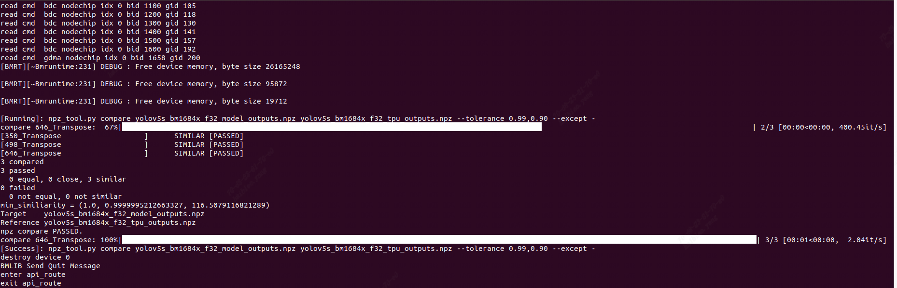
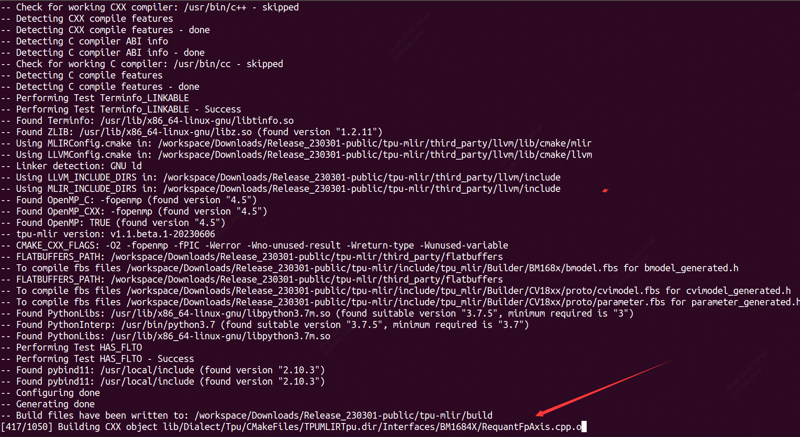
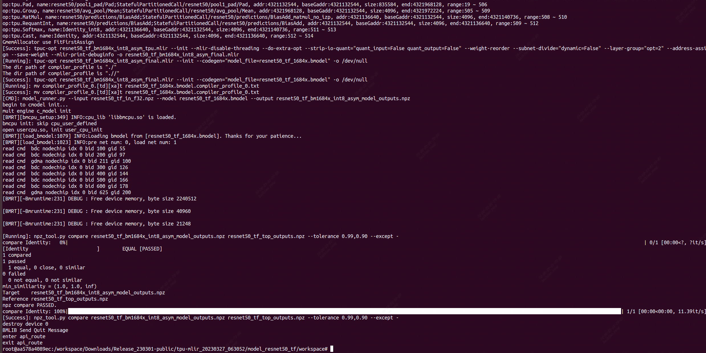
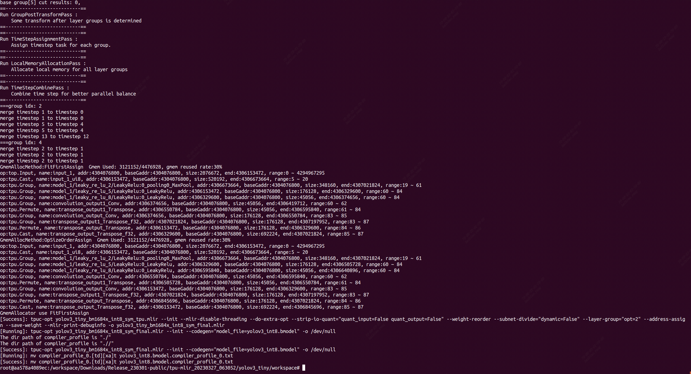
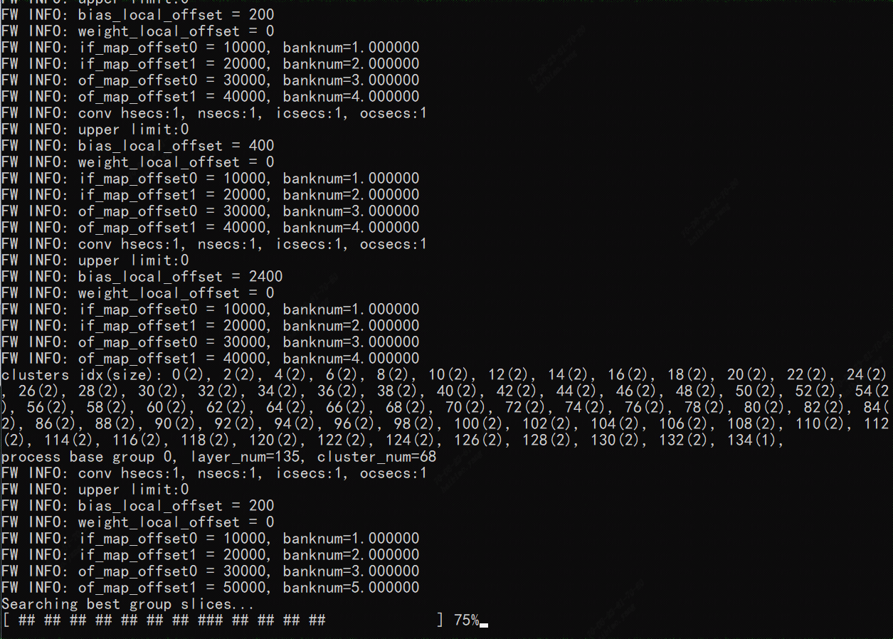

`TPU-MLIR`较`TPU-NNTC`的优势

`TPU-NNTC`的转换流程


`TPU-MLIR`的转换流程


### 1、开发环境配置

- Linux开发环境
  1. 一台安装了Ubuntu16.04/18.04/20.04的x86主机，运行内存建议12GB以上
  2. 下载SophonSDK开发包(v23.03.01)


#### （1）解压缩SDK包

```shell
sudo apt-get install p7zip
sudo apt-get install p7zip-full
7z x Release_<date>-public.zip
cd Release_<date>-public
```

#### （2）Docker 安装--TPU-MLIR环境初始化

```shell
# 安装docker
sudo apt-get install docker.io
# docker命令免root权限执行
# 创建docker用户组，若已有docker组会报错，没关系可忽略
sudo groupadd docker
# 将当前用户加入docker组
sudo gpasswd -a ${USER} docker
# 重启docker服务
sudo service docker restart
# 切换当前会话到新group或重新登录重启X会话
newgrp docker
```

```
提示：需要logout系统然后重新登录，再使用docker就不需要sudo了。
```

#### （3）创建docker容器并进入Docker

```
docker run -v $PWD/:/workspace -p 8001:8001 -it sophgo/tpuc_dev:latest
```


#### （4）加载tpu-mlir--激活环境变量

以下操作需要在Docker容器中。关于Docker的使用, 请参考 [启动Docker Container](https://doc.sophgo.com/sdk-docs/v23.03.01/docs_latest_release/docs/tpu-mlir/quick_start/html/02_env.html#docker-container-setup) 。

```shell
$ tar zxf tpu-mlir_xxxx.tar.gz
$ cd tpu-mlir_xxxx
$ source tpu-mlir_xxxx_XXXX/envsetup.sh
```

_xxxx表示的时tpu-mlir的版本号，`envsetup.sh` 会添加以下环境变量:

| 变量名         | 值                        | 说明                                   |
| -------------- | ------------------------- | -------------------------------------- |
| TPUC_ROOT      | tpu-mlir_xxx              | 解压后SDK包的位置                      |
| MODEL_ZOO_PATH | ${TPUC_ROOT}/../model-zoo | model-zoo文件夹位置, 与SDK在同一级目录 |

`envsetup.sh` 对环境变量的修改内容为:

```
export PATH=${TPUC_ROOT}/bin:$PATH
export PATH=${TPUC_ROOT}/python/tools:$PATH
export PATH=${TPUC_ROOT}/python/utils:$PATH
export PATH=${TPUC_ROOT}/python/test:$PATH
export PATH=${TPUC_ROOT}/python/samples:$PATH
export LD_LIBRARY_PATH=$TPUC_ROOT/lib:$LD_LIBRARY_PATH
export PYTHONPATH=${TPUC_ROOT}/python:$PYTHONPATH
export MODEL_ZOO_PATH=${TPUC_ROOT}/../model-zoo
```


*==**以下的编译模型均需要保证docker中进行和开发环境的source**==*

### 2、编译ONNX模型

本章以 `yolov5s.onnx` 为例, 介绍如何编译迁移一个onnx模型至BM1684X TPU平台运行。

该模型来自yolov5的官网: https://github.com/ultralytics/yolov5/releases/download/v6.0/yolov5s.onnx

#### （1）准备工作目录、模型文件和数据

建立 `model_yolov5s` 目录, 注意是与tpu-mlir同级目录; 并把模型文件和图片文件都 放入 `model_yolov5s` 目录中。

操作命令如下:

```shell
#此时工作目录还在tpu-mlir_xxxx文件夹下
$ mkdir model_yolov5s && cd model_yolov5s
$ cp $TPUC_ROOT/regression/model/yolov5s.onnx .
$ cp -rf $TPUC_ROOT/regression/dataset/COCO2017 .
$ cp -rf $TPUC_ROOT/regression/image .
$ mkdir workspace && cd workspace
```

这里的 `$TPUC_ROOT` 是环境变量, 对应tpu-mlir_xxxx目录。

转换模型主要分两步（docker中执行）

#### （2）ONNX转MLIR

​	 一是通过 `model_transform.py` 将原始模型 转换成**mlir**文件；

如果模型是图片输入, 在转模型之前我们需要了解模型的预处理。如果模型用预处理后的npz文件做输入, 则不需要考虑预处理。 预处理过程用公式表达如下( x代表输入):


官网yolov5的图片是rgb, 每个值会乘以 `1/255` , 转换成mean和scale对应为 `0.0,0.0,0.0` 和 `0.0039216,0.0039216,0.0039216` 。

模型转换命令如下:

```shell
$ model_transform.py \
    --model_name yolov5s \
    --model_def ../yolov5s.onnx \
    --input_shapes [[1,3,640,640]] \
    --mean 0.0,0.0,0.0 \
    --scale 0.0039216,0.0039216,0.0039216 \
    --keep_aspect_ratio \
    --pixel_format rgb \
    --output_names 350,498,646 \
    --test_input ../image/dog.jpg \
    --test_result yolov5s_top_outputs.npz \
    --mlir yolov5s.mlir \
    #--post_handle_type yolo 此参数可以不加，不进行后处理，防止后边的npz文件compare时报错
```

转换过程输出内容：


最终生成`${model_name}_in_f32.npz`等文件如下：


#### （3）MLIR转FP32

​	 二是通过 `model_deploy.py` 将**mlir**文件转换成**bmodel**。

将mlir文件转换成f32的bmodel, 命令如下:

```shell
$ model_deploy.py \
    --mlir yolov5s.mlir \
    --quantize F32 \
    --chip bm1684x \
    --test_input yolov5s_in_f32.npz \
    --test_reference yolov5s_top_outputs.npz \
    --tolerance 0.99,0.99 \
    --model yolov5s_1684x_f32.bmodel
```

转换过程输出内容如下：




最终生成`${model_name}_1684x_f32.bmodel`等相关文件如下：


#### （4）MLIR转INT8模型

##### 生成校准表

转INT8模型前需要跑calibration, 得到校准表; 输入数据的数量根据情况准备100~1000张左右。

然后用校准表, 生成对称或非对称bmodel。如果对称符合需求, 一般不建议用非对称, 因为 非对称的性能会略差于对称模型。

这里用现有的100张来自COCO2017的图片举例, 执行calibration:

```
$ run_calibration.py yolov5s.mlir \
    --dataset ../COCO2017 \
    --input_num 100 \
    -o yolov5s_cali_table
```

运行过程图：


运行完成后会生成名为 `${model_name}_cali_table` 的文件, 该文件用于后续编译INT8 模型的输入文件。


##### 编译为INT8对称量化模型

转成INT8对称量化模型, 执行如下命令:

```shell
$ model_deploy.py \
    --mlir yolov5s.mlir \
    --quantize INT8 \
    --calibration_table yolov5s_cali_table \
    --chip bm1684x \
    --test_input yolov5s_in_f32.npz \
    --test_reference yolov5s_top_outputs.npz \
    --tolerance 0.85,0.45 \
    --model yolov5s_1684x_int8_sym.bmodel
```

转换过程输出内容如下：


最终生成`${model_name}_1684x_int8_sym.bmodel`等相关文件如下：


##### 编译为INT8非对称量化模型

转成INT8非对称量化模型, 执行如下命令:

```shell
$ model_deploy.py \
    --mlir yolov5s.mlir \
    --quantize INT8 \
    --asymmetric \
    --calibration_table yolov5s_cali_table \
    --chip bm1684x \
    --test_input yolov5s_in_f32.npz \
    --test_reference yolov5s_top_outputs.npz \
    --tolerance 0.90,0.55 \
    --model yolov5s_1684x_int8_asym.bmodel
```

编译完成后, 会生成名为 `${model_name}_1684x_int8_asym.bmodel` 的文件。


#### 效果对比

在本发布包中有用python写好的yolov5用例, 源码路径 `$TPUC_ROOT/python/samples/detect_yolov5.py` , 用于对图片进行目标检测。阅读该 代码可以了解模型是如何使用的: 先预处理得到模型的输入, 然后推理得到输出, 最后做后处理。 用以下代码分别来验证onnx/f32/int8的执行结果。

onnx模型的执行方式如下, 得到 `dog_onnx.jpg` :

```
$ detect_yolov5.py \
    --input ../image/dog.jpg \
    --model ../yolov5s.onnx \
    --output dog_onnx.jpg
```

f32 bmodel的执行方式如下, 得到 `dog_f32.jpg` :

```
$ detect_yolov5.py \
    --input ../image/dog.jpg \
    --model yolov5s_1684x_f32.bmodel \
    --output dog_f32.jpg
```

int8对称bmodel的执行方式如下, 得到 `dog_int8_sym.jpg` :

```
$ detect_yolov5.py \
    --input ../image/dog.jpg \
    --model yolov5s_1684x_int8_sym.bmodel \
    --output dog_int8_sym.jpg
```

int8非对称bmodel的执行方式如下, 得到 `dog_int8_asym.jpg` :

```
$ detect_yolov5.py \
    --input ../image/dog.jpg \
    --model yolov5s_1684x_int8_asym.bmodel \
    --output dog_int8_asym.jpg
```

最终生成检测图片文件如下：


四张图片检测精度对比如下:


```
由于运行环境不同, 最终的效果和精度与上图会有些差异。
```


#### 问题--解决方案

==**mlir转F32** 遇到的输出信息错误：==


==**解决过程**==

错误1解决办法：

【原因分析】由于`model_transform.py`文件进行yolo的后处理，导致生成的两个npz文件的shape不一样，从而运行出错。

【解决办法】将`model_transform.py`运行命令修改后处理操作步骤即可。

（删除--post_handle_type yolo选项，默认后处理生成的npz文件的shape即可保持一致，成功生成FP32格式模型）

【解决过程】--分析错误，一步一步追踪错误原因

`mlir_shell.py`的runtime error


 回归验证过程图（可忽略）--tpi-mlir_v1.0版本的回归测试，这里用不到，仅作记录使用

```shell
$ ./run_all.sh
```




### 3、编译TFlite模型

首先，按照1中的环境配置进行设置；

以 `resnet50_int8.tflite` 模型为例, 介绍如何编译迁移一个TFLite模型至BM1684X TPU平台运行。

#### （1）准备工作目录、模型文件和数据

建立 `model_resnet50_tf` 目录, 注意是与tpu-mlir同级目录; 并把测试图片文件放入 `model_resnet50_tf` 目录中。

操作如下:

```shell
$ mkdir model_resnet50_tf && cd model_resnet50_tf
$ cp $TPUC_ROOT/regression/model/resnet50_int8.tflite .
$ cp -rf $TPUC_ROOT/regression/image .
$ mkdir workspace && cd workspace
```

这里的 `$TPUC_ROOT` 是环境变量, 对应tpu-mlir_xxxx目录。

#### （2）TFLite转MLIR

本例中的模型是bgr输入, mean为 `103.939,116.779,123.68`, scale为 `1.0,1.0,1.0`

模型转换命令如下:

```shell
$ model_transform.py \
    --model_name resnet50_tf \
    --model_def  ../resnet50_int8.tflite \
    --input_shapes [[1,3,224,224]] \
    --mean 103.939,116.779,123.68 \
    --scale 1.0,1.0,1.0 \
    --pixel_format bgr \
    --test_input ../image/cat.jpg \
    --test_result resnet50_tf_top_outputs.npz \
    --mlir resnet50_tf.mlir
```

转成mlir文件后, 会生成一个 `resnet50_tf_in_f32.npz` 文件, 该文件是模型的输入文件。

转换过程图如下：


输出文件如下，转成mlir文件后, 会生成一个 `resnet50_tf_in_f32.npz` 文件, 该文件是模型的输入文件。


#### （3）MLIR转模型

该模型是tflite非对称量化模型, 可以按如下参数转成模型:

```
$ model_deploy.py \
    --mlir resnet50_tf.mlir \
    --quantize INT8 \
    --asymmetric \
    --chip bm1684x \
    --test_input resnet50_tf_in_f32.npz \
    --test_reference resnet50_tf_top_outputs.npz \
    --model resnet50_tf_1684x.bmodel
```

编译过程图如下：




编译完成后, 会生成名为 `resnet50_tf_1684x.bmodel` 的文件。


### 4、编译Caffe模型

首先，按照1中的环境配置进行设置；

本章以 `mobilenet_v2_deploy.prototxt` 和 `mobilenet_v2.caffemodel` 为例, 介绍如何编译迁移一个caffe模型至BM1684X TPU平台运行。

#### （1）准备工作目录、模型文件和数据

建立 `mobilenet_v2` 目录, 注意是与tpu-mlir同级目录; 并把模型文件和图片文件都 放入 `mobilenet_v2` 目录中。

操作如下:

```shell
$ mkdir mobilenet_v2 && cd mobilenet_v2
$ cp $TPUC_ROOT/regression/model/mobilenet_v2_deploy.prototxt .
$ cp $TPUC_ROOT/regression/model/mobilenet_v2.caffemodel .
$ cp -rf $TPUC_ROOT/regression/dataset/ILSVRC2012 .
$ cp -rf $TPUC_ROOT/regression/image .
$ mkdir workspace && cd workspace
```

这里的 `$TPUC_ROOT` 是环境变量, 对应tpu-mlir_xxxx目录。

#### （2）Caffe转MLIR

本例中的模型是 BGR 输入, mean和scale分别为 `103.94,116.78,123.68` 和 `0.017,0.017,0.017`。

模型转换命令如下:

```shell
$ model_transform.py \
    --model_name mobilenet_v2 \
    --model_def ../mobilenet_v2_deploy.prototxt \
    --model_data ../mobilenet_v2.caffemodel \
    --input_shapes [[1,3,224,224]] \
    --resize_dims=256,256 \
    --mean 103.94,116.78,123.68 \
    --scale 0.017,0.017,0.017 \
    --pixel_format bgr \
    --test_input ../image/cat.jpg \
    --test_result mobilenet_v2_top_outputs.npz \
    --mlir mobilenet_v2.mlir
```

转换过程图如下：


转换完成输出文件如下，转成mlir文件后, 会生成一个 `${model_name}_in_f32.npz` 文件, 该文件是模型的输入文件。


#### （3）MLIR转F32模型

将mlir文件转换成f32的bmodel, 操作方法如下:

```
$ model_deploy.py \
    --mlir mobilenet_v2.mlir \
    --quantize F32 \
    --chip bm1684x \
    --test_input mobilenet_v2_in_f32.npz \
    --test_reference mobilenet_v2_top_outputs.npz \
    --tolerance 0.99,0.99 \
    --model mobilenet_v2_1684x_f32.bmodel
```

编译过程如下：


编译完成后, 会生成名为 `${model_name}_1684x_f32.bmodel` 的文件。


#### （4）MLIR转INT8模型

##### 生成校准表

转INT8模型前需要跑calibration, 得到校准表; 输入数据的数量根据情况准备100~1000张左右。

然后用校准表, 生成对称或非对称bmodel。如果对称符合需求, 一般不建议用非对称, 因为 非对称的性能会略差于对称模型。

这里用现有的100张来自ILSVRC2012的图片举例, 执行calibration:

```shell
$ run_calibration.py mobilenet_v2.mlir \
    --dataset ../ILSVRC2012 \
    --input_num 100 \
    -o mobilenet_v2_cali_table
```

生成校准表过程：


运行完成后会生成名为 `${model_name}_cali_table` 的文件, 该文件用于后续编译INT8 模型的输入文件。


##### 编译为INT8对称量化模型

转成INT8对称量化模型, 执行如下命令:

```
$ model_deploy.py \
    --mlir mobilenet_v2.mlir \
    --quantize INT8 \
    --calibration_table mobilenet_v2_cali_table \
    --chip bm1684x \
    --test_input mobilenet_v2_in_f32.npz \
    --test_reference mobilenet_v2_top_outputs.npz \
    --tolerance 0.96,0.70 \
    --model mobilenet_v2_1684x_int8_sym.bmodel
```

编译过程输出如下：


编译完成后, 会生成名为 `${model_name}_1684x_int8_sym.bmodel` 的文件。


##### 编译为INT8非对称量化模型

转成INT8非对称量化模型, 执行如下命令:

```shell
$ model_deploy.py \
    --mlir mobilenet_v2.mlir \
    --quantize INT8 \
    --asymmetric \
    --calibration_table mobilenet_v2_cali_table \
    --chip bm1684x \
    --test_input mobilenet_v2_in_f32.npz \
    --test_reference mobilenet_v2_top_outputs.npz \
    --tolerance 0.95,0.69 \
    --model mobilenet_v2_1684x_int8_asym.bmodel
```

编译过程输出如下：


编译完成后, 会生成名为 `${model_name}_1684x_int8_asym.bmodel` 的文件。


### 5、混精度使用方法

首先，按照1中的环境配置进行设置；

本章以检测网络 `yolov3 tiny` 网络模型为例, 介绍如何使用混精度。 该模型来自https://github.com/onnx/models/tree/main/vision/object_detection_segmentation/tiny-yolov3。

#### （1）准备工作目录、模型文件和数据

建立 `yolov3_tiny` 目录, 注意是与tpu-mlir同级目录; 并把模型文件和图片文件都 放入 `yolov3_tiny` 目录中。

操作如下:

```shell
$ mkdir yolov3_tiny && cd yolov3_tiny
$ wget https://github.com/onnx/models/raw/main/vision/object_detection_segmentation/tiny-yolov3/model/tiny-yolov3-11.onnx
$ cp -rf $TPUC_ROOT/regression/dataset/COCO2017 .
$ mkdir workspace && cd workspace
```

这里的 `$TPUC_ROOT` 是环境变量, 对应tpu-mlir_xxxx目录。 注意如果 `tiny-yolov3-11.onnx` 用wget下载失败, 可以通过访问github下载原包放至`yolov3_tiny`文件夹下。

#### （2）验证原始模型

`detect_yolov3.py` 是已经写好的验证程序, 可以用来对 `yolov3_tiny` 网络进行验证。执行过程如下:

```shell
$ detect_yolov3.py \
     --model ../tiny-yolov3-11.onnx \
     --input ../COCO2017/000000366711.jpg \
     --output yolov3_onnx.jpg
```

执行完后打印检测到的结果如下:

```
person:60.7%
orange:77.5%
```


并得到图片 `yolov3_onnx.jpg`, 如下


#### （3）转成INT8对称量化模型

如前面章节介绍的转模型方法, 这里不做参数说明, 只有操作过程。

##### 第一步: 转成F32 mlir

```
$ model_transform.py \
    --model_name yolov3_tiny \
    --model_def ../tiny-yolov3-11.onnx \
    --input_shapes [[1,3,416,416]] \
    --scale 0.0039216,0.0039216,0.0039216 \
    --pixel_format rgb \
    --keep_aspect_ratio \
    --pad_value 128 \
    --output_names=transpose_output1,transpose_output \
    --mlir yolov3_tiny.mlir
```


最终生成文件如下：


##### 第二步: 生成calibartion table

```
$ run_calibration.py yolov3_tiny.mlir \
    --dataset ../COCO2017 \
    --input_num 100 \
    -o yolov3_cali_table
```


生成校准表文件如下：


##### 第三步: 转对称量化模型

```
$ model_deploy.py \
    --mlir yolov3_tiny.mlir \
    --quantize INT8 \
    --calibration_table yolov3_cali_table \
    --chip bm1684x \
    --model yolov3_int8.bmodel
```



最终输出文件如下：


##### 第四步: 验证模型

```
    $ detect_yolov3.py \
         --model yolov3_int8.bmodel \
         --input ../COCO2017/000000366711.jpg \
         --output yolov3_int8.jpg
```

执行完后有如下打印信息:

```
person:64.0%
orange:73.0%
```


得到图片 `yolov3_int8.jpg`, 如下


可以看出int8对称量化模型相对原始模型, 在这张图上对橘子个体的检测效果不佳。

#### （4）转成混精度量化模型

在转int8对称量化模型的基础上, 执行如下步骤。

##### 第一步: 生成混精度量化表

使用 `run_qtable.py` 生成混精度量化表, 相关参数说明如下:

| 参数名            | 必选？ | 说明                                                         |
| ----------------- | ------ | ------------------------------------------------------------ |
| 无                | 是     | 指定mlir文件                                                 |
| dataset           | 否     | 指定输入样本的目录, 该路径放对应的图片, 或npz, 或npy         |
| data_list         | 否     | 指定样本列表, 与dataset必须二选一                            |
| calibration_table | 是     | 输入校准表                                                   |
| chip              | 是     | 指定模型将要用到的平台, 支持bm1684x/bm1684/cv183x/cv182x/cv181x/cv180x |
| fp_type           | 否     | 指定混精度使用的float类型, 支持auto,F16,F32,BF16，默认为auto，表示由程序内部自动选择 |
| input_num         | 否     | 指定输入样本数量, 默认用10个                                 |
| expected_cos      | 否     | 指定期望网络最终输出层的最小cos值,一般默认为0.99即可，越小时可能会设置更多层为浮点计算 |
| min_layer_cos     | 否     | 指定期望每层输出cos的最小值，低于该值会尝试设置浮点计算, 一般默认为0.99即可 |
| debug_cmd         | 否     | 指定调试命令字符串，开发使用, 默认为空                       |
| o                 | 是     | 输出混精度量化表                                             |

本例中采用默认10张图片校准, 执行命令如下（对于CV18xx系列的芯片，将chip设置为对应的芯片名称即可）:

```shell
$ run_qtable.py yolov3_tiny.mlir \
    --dataset ../COCO2017 \
    --calibration_table yolov3_cali_table \
    --chip bm1684x \
    --min_layer_cos 0.999 \ #若这里使用默认的0.99时，程序会检测到原始int8模型已满足0.99的cos，从而直接不再搜素
    --expected_cos 0.9999 \
    -o yolov3_qtable
```

执行完后最后输出如下打印:（不同编译主机的输出信息可能略微不同）


上面int8 outputs_cos表示int8模型原本网络输出和fp32的cos相似度，mix model outputs_cos表示部分层使用混精度后网络输出的cos相似度，total time表示搜索时间为11.2秒， 另外，生成的混精度量化表 `yolov3_qtable`。


`yolov3_qtable`内容如下:


该表中, 第一列表示相应的layer, 第二列表示类型, 支持的类型有F32/F16/BF16/INT8。 另外同时也会生成一个loss表文件 `full_loss_table.txt`。


 `full_loss_table.txt`内容如下:


该表按cos从小到大顺利排列, 表示该层的前驱Layer根据各自的cos已换成相应的浮点模式后, 该层计算得到的cos, 若该cos仍小于前面min_layer_cos参数，则会将该层及直接后继层设置为浮点计算。 `run_qtable.py` 会在每次设置某相邻2层为浮点计算后，接续计算整个网络的输出cos，若该cos大于指定的expected_cos，则退出搜素。因此，若设置更大的expected_cos，会尝试将更多层设为浮点计算。

##### 第二步: 生成混精度量化模型

```
$ model_deploy.py \
    --mlir yolov3_tiny.mlir \
    --quantize INT8 \
    --quantize_table yolov3_qtable \
    --calibration_table yolov3_cali_table \
    --chip bm1684x \
    --model yolov3_mix.bmodel
```


最终生成文件如下：


##### 第三步: 验证混精度模型

```
$ detect_yolov3.py \
     --model yolov3_mix.bmodel \
     --input ../COCO2017/000000366711.jpg \
     --output yolov3_mix.jpg
```

执行完后打印结果为:

```
person:64.0%
orange:72.9%
```


得到图片`yolov3_mix.jpg`, 如下


需要说明的是，除了使用run_qtable生成量化表外，也可根据模型中每一层的相似度对比结果，自行设置量化表中需要做混精度量化的OP的名称和量化类型。

### 6、模型部署样例

#### （1）使用TPU做前处理

目前TPU-MLIR支持的两个主要系列芯片BM168x与CV18xx均支持将图像常见的预处理加入到模型中进行计算。开发者可以在模型编译阶段,通过编译选项传递相应预处理参数,由编译器直接在模型运算前插⼊相应前处理算⼦,⽣成的bmodel或cvimodel即可以直接以预处理前的图像作为输⼊,随模型推理过程使⽤TPU处理前处理运算。

| 预处理类型   | BM168x | CV18xx |
| ------------ | ------ | ------ |
| 图像裁剪     | True   | True   |
| 归一化计算   | True   | True   |
| NHWC to NCHW | True   | True   |
| BGR/RGB 转换 | True   | True   |

其中图像裁剪会先将图片按使用model_transform工具时输入的“–resize_dims”参数将图片调整为对应的大小, 再裁剪成模型输入的尺寸。而归一化计算支持直接将未进行预处理的图像数据(即unsigned int8格式的数据)做归一化处理。

若要将预处理融入到模型中, 则需要在使用model_deploy工具进行部署时使用“–fuse_preprocess”参数。如果要做验证, 则传入的test_input需要是图像原始格式的输入(即jpg, jpeg和png格式), 相应地会生成原始图像输入对应的npz文件,名称为 `${model_name}_in_ori.npz`。

此外, 当实际外部输入格式与模型的格式不相同时, 用“–customization_format”指定实际的外部输入格式, 支持的格式说明如下：

| customization_format | 说明                                   | BM1684X | CV18xx |
| -------------------- | -------------------------------------- | ------- | ------ |
| None                 | 与原始模型输入保持一致, 不做处理。默认 | True    | True   |
| RGB_PLANAR           | rgb顺序,按照nchw摆放                   | True    | True   |
| RGB_PACKED           | rgb顺序,按照nhwc摆放                   | True    | True   |
| BGR_PLANAR           | bgr顺序,按照nchw摆放                   | True    | True   |
| BGR_PACKED           | bgr顺序,按照nhwc摆放                   | True    | True   |
| GRAYSCALE            | 仅有⼀个灰⾊通道,按nchw摆              | True    | True   |
| YUV420_PLANAR        | yuv420 planner格式,来⾃vpss的输⼊      | False   | True   |
| YUV_NV21             | yuv420的NV21格式,来⾃vpss的输⼊        | False   | True   |
| YUV_NV12             | yuv420的NV12格式,来⾃vpss的输⼊        | False   | True   |
| RGBA_PLANAR          | rgba格式,按照nchw摆放                  | False   | True   |

其中“YUV*”类格式为CV18xx系列芯片特有的输入格式。当customization_format中颜色通道的顺序与模型输入不同时, 将会进行通道转换操作。若指令中未设置customization_format参数,则根据使用model_transform工具时定义的pixel_format和channel_format参数自动获取对应的customization_format。

**以mobilenet_v2模型为例, 参考“编译Caffe模型”章节, 在tpu-mlir/regression/regression_out/目录下使用model_transform工具生成原始mlir, 并通过run_calibration工具生成校准表。**

#### （2）BM1684X部署

生成融合预处理的INT8对称量化bmodel模型指令如下：

```shell
$ model_deploy.py \
    --mlir mobilenet_v2.mlir \
    --quantize INT8 \
    --calibration_table mobilenet_v2_cali_table \
    --chip bm1684x \
    --test_input ../image/cat.jpg \
    --test_reference mobilenet_v2_top_outputs.npz \
    --tolerance 0.96,0.70 \
    --fuse_preprocess \
    --model mobilenet_v2_bm1684x_int8_sym_fuse_preprocess.bmodel
```

过程输出图如下：


最终生成文件如下：


### 7、各框架模型转ONNX参考

本章节主要将PyTorch, TensorFlow与PaddlePaddle模型转为ONNX模型的方式参考，读者也可以参考ONNX官方仓库提供的转模型教程： https://github.com/onnx/tutorials。

本章节中的所有操作均在Docker容器中进行，具体的环境配置方式请参考第1章的内容。

#### （1）PyTorch模型转ONNX

本节以一个自主搭建的简易PyTorch模型为例进行onnx转换，环境配置和目录和第1节保持一致。

##### 步骤0：创建工作目录

在命令行中创建并进入torch_model目录。

```shell
$ mkdir torch_model
$ cd torch_model
```

##### 步骤1：搭建并保存模型

在该目录下创建名为simple_net.py的脚本并运行，脚本的具体内容如下：

```python
#!/usr/bin/env python3
import torch
 
# Build a simple nn model
class SimpleModel(torch.nn.Module):
 
   def __init__(self):
       super(SimpleModel, self).__init__()
       self.m1 = torch.nn.Conv2d(3, 8, 3, 1, 0)
      self.m2 = torch.nn.Conv2d(8, 8, 3, 1, 1)

   def forward(self, x):
      y0 = self.m1(x)
      y1 = self.m2(y0)
      y2 = y0 + y1
      return y2

# Create a SimpleModel and save its weight in the current directory
model = SimpleModel()
torch.save(model.state_dict(), "weight.pth")
```

运行完后我们会在当前目录下获得一个weight.pth的权重文件。


##### 步骤2：导出ONNX模型

在该目录下创建另一个名为export_onnx.py的脚本并运行，脚本的具体内容如下：

```python
 #!/usr/bin/env python3
 import torch
 from simple_net import SimpleModel
 
 # Load the pretrained model and export it as onnx
 model = SimpleModel()
 model.eval()
 checkpoint = torch.load("weight.pth", map_location="cpu")
 model.load_state_dict(checkpoint)

# Prepare input tensor
input = torch.randn(1, 3, 16, 16, requires_grad=True)

# Export the torch model as onnx
torch.onnx.export(model,
                  input,
                  'model.onnx', # name of the exported onnx model
                  opset_version=13,
                  export_params=True,
                  do_constant_folding=True)
```

运行完脚本后，我们即可在当前目录下得到名为model.onnx的onnx模型。


#### （2）TensorFlow模型转ONNX

本节以TensorFlow官方仓库中提供的mobilenet_v1_0.25_224模型作为转换样例。

#####  步骤0：创建工作目录

在命令行中创建并进入tf_model目录。

```
$ mkdir tf_model
$ cd tf_model
```

##### 步骤1：准备并转换模型

命令行中通过以下命令下载模型并利用tf2onnx工具将其导出为ONNX模型：

```shell
$ wget -nc http://download.tensorflow.org/models/mobilenet_v1_2018_08_02/mobilenet_v1_0.25_224.tgz
# tar to get "*.pb" model def file
$ tar xzf mobilenet_v1_0.25_224.tgz
```


```shell
$ python -m tf2onnx.convert --graphdef mobilenet_v1_0.25_224_frozen.pb \
    --output mnet_25.onnx --inputs input:0 \
    --inputs-as-nchw input:0 \
    --outputs MobilenetV1/Predictions/Reshape_1:0
```

运行以上所有命令后我们即可在当前目录下得到名为mnet_25.onnx的onnx模型。


#### （3）PaddlePaddle模型转ONNX

本节以PaddlePaddle官方仓库中提供的SqueezeNet1_1模型作为转换样例。

##### 步骤0：创建工作目录

在命令行中创建并进入pp_model目录。

```shell
$ mkdir pp_model
$ cd pp_model
```

##### 步骤1：准备模型

在命令行中通过以下命令下载模型：

```shell
$ wget https://bj.bcebos.com/paddlehub/fastdeploy/SqueezeNet1_1_infer.tgz
$ tar xzf SqueezeNet1_1_infer.tgz
$ cd SqueezeNet1_1_infer
```

并用PaddlePaddle项目中的paddle_infer_shape.py脚本对模型进行shape推理,此处将输入shape以NCHW的格式设置为[1,3,224,224]：

```shell
$ wget https://raw.githubusercontent.com/PaddlePaddle/Paddle2ONNX/develop/tools/paddle/paddle_infer_shape.py
```


```shell
$ python paddle_infer_shape.py  --model_dir . \
                          --model_filename inference.pdmodel \
                          --params_filename inference.pdiparams \
                          --save_dir new_model \
                          --input_shape_dict="{'inputs':[1,3,224,224]}"
```

运行完以上所有命令后我们将处于SqueezeNet1_1_infer目录下，并在该目录下有一个new_model的目录。


##### 步骤2：转换模型

在命令行中通过以下命令安装paddle2onnx工具，并利用该工具将PaddlePaddle模型转为ONNX模型：

```shell
$ pip install paddle2onnx
$ paddle2onnx  --model_dir new_model \
          --model_filename inference.pdmodel \
          --params_filename inference.pdiparams \
          --opset_version 13 \
          --save_file squeezenet1_1.onnx
```

运行完以上所有命令后我们将获得一个名为squeezenet1_1.onnx的onnx模型。


### 8、BM168x测试指南

#### （1）配置系统环境

首次使用Docker, 那么请使用 **开发环境配置**中的方法安装 并配置Docker。

首次使用 `git-lfs` 可执行下述命 令进行安装和配置

【仅首次执行, 同时**该配置是在用户自己系统**中, 并**非Docker container中**】

```
$ sudo apt install curl
$ curl -s https://packagecloud.io/install/repositories/github/git-lfs/script.deb.sh | sudo bash
$ sudo apt-get install git-lfs
```


BM1684X云平台PCIE模式下：


#### （2）获取 model-zoo 模型

在 `tpu-mlir_xxxx.tar.gz` (tpu-mlir的发布包)的同级目录下, 使用以下命令克隆 `model-zoo` 工程:

```
$ git clone --depth=1 https://github.com/sophgo/model-zoo
$ cd model-zoo
$ git lfs pull --include "*.onnx,*.jpg,*.JPEG" --exclude=""
$ cd ../
```

BM1684X云平台PCIE模式下lfs的pull过程：


如果已经克隆过 `model-zoo` 可以执行以下命令同步模型到最新状态:

```
$ cd model-zoo
$ git pull
$ git lfs pull --include "*.onnx,*.jpg,*.JPEG" --exclude=""
$ cd ../
```

此过程会从 `GitHub` 上下载大量数据。由于具体网络环境的差异, 此过程可能耗时较长。

#### （3）获取 tpu-perf 工具

从 https://github.com/sophgo/tpu-perf/releases 地址下载最新的 `tpu-perf` wheel安装包。例如: tpu_perf-x.x.x-py3-none-manylinux2014_x86_64.whl 。并将 `tpu-perf` 包放置到与 `model-zoo` 同一级目录下。此时的目录结构应该为如下形式:

```
├── tpu_perf-x.x.x-py3-none-manylinux2014_x86_64.whl
├── tpu-mlir_xxxx
└── model-zoo
```


#### （4）部署测试

进入docker容器，并激活tpu-mlir的环境变量,XXXX表示存放tpu_mlir的目录。

```shell
$ docker exec -it 容器id /bin/bash
$ source XXXX/XXXX/XXXX/envsetup.sh
```


安装 `tpu-perf`,通过pip安装下载好的whl文件。

```shell
$ pip3 install ../tpu_perf-x.x.x-py3-none-manylinux2014_x86_64.whl
```

#### （5）编译模型

`model-zoo` 的相关 `confg.yaml` 配置了SDK的测试内容。例如: resnet18的 配置文件为 `model-zoo/vision/classification/resnet18-v2/config.yaml` 。

执行以下命令, 运行全部测试样例:

```shell
$ cd ../model-zoo
$ python3 -m tpu_perf.build --mlir -l full_cases.txt
```

测试过程图如下：


此时会编译以下模型:

```
* efficientnet-lite4
* mobilenet_v2
* resnet18
* resnet50_v2
* shufflenet_v2
* squeezenet1.0
* vgg16
* yolov5s
```

命令正常结束后, 会看到新生成的 `output` 文件夹(测试输出内容都在该文件夹中)。 修改 `output` 文件夹的属性, 以保证其可以被Docker外系统访问。

```
$ chmod -R a+rw output
```

#### （6）PCIE模式运行测试

运行测试需要在 Docker 外面的环境(此处假设您已经安装并配置好了1684X设备和 驱动)中进行, 可以退出 Docker 环境:

```shell
$ exit
```

PCIE 板卡下运行以下命令, 测试生成的 `bmodel` 性能。

```shell
$ pip3 install ./tpu_perf-*-py3-none-manylinux2014_x86_64.whl
$ cd model-zoo
$ python3 -m tpu_perf.run --mlir -l full_cases.txt
```

注意：如果主机上安装了多块SOPHGO的加速卡，可以在使用 `tpu_perf` 的时候，通过添加 `--devices id` 来指定 `tpu_perf` 的运行设备。如：

```shell
$ python3 -m tpu_perf.run --devices 2 --mlir -l full_cases.txt
```


### 9、编译Torch模型

本章以 `yolov5s.pt` 为例, 介绍如何编译迁移一个pytorch模型至BM1684X TPU平台运行。

本章需要如下文件(其中xxxx对应实际的版本信息):

**tpu-mlir_xxxx.tar.gz (tpu-mlir的发布包)**

#### （1）准备工作目录、模型文件和数据

操作命令如下:

```shell
#此时工作目录还在tpu-mlir_xxxx文件夹下
$ mkdir yolov5s_torch && cd yolov5s_torch
$ cp $TPUC_ROOT/regression/model/yolov5s.pt .
$ cp -rf $TPUC_ROOT/regression/dataset/COCO2017 .
$ cp -rf $TPUC_ROOT/regression/image .
$ mkdir workspace && cd workspace
```

这里的 `$TPUC_ROOT` 是环境变量, 对应tpu-mlir_xxxx目录。

转换模型主要分两步（docker中执行）

#### （2）TORCH转MLIR

​	 一是通过 `model_transform.py` 将原始模型 转换成**mlir**文件；

如果模型是图片输入, 在转模型之前我们需要了解模型的预处理。如果模型用预处理后的npz文件做输入, 则不需要考虑预处理。 预处理过程用公式表达如下( x代表输入):


官网yolov5的图片是rgb, 每个值会乘以 `1/255` , 转换成mean和scale对应为 `0.0,0.0,0.0` 和 `0.0039216,0.0039216,0.0039216` 。

模型转换命令如下:

```shell
$ model_transform.py \
    --model_name yolov5s_pt \
    --model_def ../yolov5s.pt \
    --input_shapes [[1,3,640,640]] \
    --mean 0.0,0.0,0.0 \
    --scale 0.0039216,0.0039216,0.0039216 \
    --keep_aspect_ratio \
    --pixel_format rgb \
    --test_input ../image/dog.jpg \
    --test_result yolov5s_pt_top_outputs.npz \
    --mlir yolov5s_pt.mlir
```

转成mlir文件后, 会生成一个 `${model_name}_in_f32.npz` 文件, 该文件是模型的输入文件。


#### （3）MLIR转F16

将mlir文件转换成f16的bmodel, 操作方法如下:

```shell
$ model_deploy.py \
    --mlir yolov5s_pt.mlir \
    --quantize F16 \
    --chip bm1684x \
    --test_input yolov5s_pt_in_f32.npz \
    --test_reference yolov5s_pt_top_outputs.npz \
    --tolerance 0.99,0.99 \
    --model yolov5s_pt_1684x_f16.bmodel
```

编译完成后, 会生成名为 `yolov5s_pt_1684x_f16.bmodel` 的文件。


#### （4）MLIR转INT8（对称性）

##### 生成校准表

转INT8模型前需要跑calibration, 得到校准表; 这里用现有的100张来自COCO2017的图片举例, 执行calibration:

```shell
$ run_calibration.py yolov5s_pt.mlir \
    --dataset ../COCO2017 \
    --input_num 100 \
    -o yolov5s_pt_cali_table
```

运行完成后会生成名为 `yolov5s_pt_cali_table` 的文件, 该文件用于后续编译INT8 模型的输入文件。


##### 编译为INT8对称量化模型

转成INT8对称量化模型, 执行如下命令:

```shell
$ vi mlir2int8.sh
model_deploy.py \
    --mlir yolov5s_pt.mlir \
    --quantize INT8 \
    --calibration_table yolov5s_pt_cali_table \
    --chip bm1684x \
    --test_input yolov5s_pt_in_f32.npz \
    --test_reference yolov5s_pt_top_outputs.npz \
    --tolerance 0.85,0.45 \
    --model yolov5s_pt_1684x_int8_sym.bmodel
$ sh mlir2int8.sh
```

运行过程：


编译完成后, 会生成名为 `yolov5s_pt_1684x_int8_sym.bmodel` 的文件。

#### （5）效果对比


## BM1684


### 编译ONNX模型

#### （1）准备工作目录、模型文件和数据

建立 `model_yolov5s` 目录, 注意是与tpu-mlir同级目录; 并把模型文件和图片文件都 放入 `model_yolov5s` 目录中。

操作命令如下:

```shell
#此时工作目录还在tpu-mlir_xxxx文件夹下
$ mkdir model_yolov5s && cd model_yolov5s
$ cp $TPUC_ROOT/regression/model/yolov5s.onnx .
$ cp -rf $TPUC_ROOT/regression/dataset/COCO2017 .
$ cp -rf $TPUC_ROOT/regression/image .
$ mkdir workspace && cd workspace
```

这里的 `$TPUC_ROOT` 是环境变量, 对应tpu-mlir_xxxx目录。

转换模型主要分两步（docker中执行）

#### （2）ONNX转MLIR

​	 一是通过 `model_transform.py` 将原始模型 转换成**mlir**文件；

如果模型是图片输入, 在转模型之前我们需要了解模型的预处理。如果模型用预处理后的npz文件做输入, 则不需要考虑预处理。 预处理过程用公式表达如下( x代表输入):


官网yolov5的图片是rgb, 每个值会乘以 `1/255` , 转换成mean和scale对应为 `0.0,0.0,0.0` 和 `0.0039216,0.0039216,0.0039216` 。

模型转换命令如下:

```shell
$ vi onnx2mlir.sh
#将以下代码写入sh文件
model_transform.py \
    --model_name yolov5s \
    --model_def ../yolov5s.onnx \
    --input_shapes [[1,3,640,640]] \
    --mean 0.0,0.0,0.0 \
    --scale 0.0039216,0.0039216,0.0039216 \
    --keep_aspect_ratio \
    --pixel_format rgb \
    --output_names 350,498,646 \
    --test_input ../image/dog.jpg \
    --test_result yolov5s_top_outputs.npz \
    --mlir yolov5s.mlir \
    #--post_handle_type yolo 此参数可以不加，不进行后处理，防止后边的npz文件compare时报错
$ sh onnx2mlir.sh
```

转换过程输出内容：


最终生成`${model_name}_in_f32.npz`等文件如下：


#### （3）MLIR转FP32

​	 二是通过 `model_deploy.py` 将**mlir**文件转换成**bmodel**。

将mlir文件转换成f32的bmodel, 命令如下:

```shell
$ vi mlir2f32.sh  
#将以下代码写入sh文件
model_deploy.py \
    --mlir yolov5s.mlir \
    --quantize F32 \
    --chip bm1684 \
    --test_input yolov5s_in_f32.npz \
    --test_reference yolov5s_top_outputs.npz \
    --tolerance 0.99,0.99 \
    --model yolov5s_1684_f32.bmodel
$ sh mlir2f32.sh
```

转换过程输出内容如下：


最终生成`${model_name}_1684_f32.bmodel`等相关文件如下：


#### （4）MLIR转INT8模型

##### 生成校准表

转INT8模型前需要跑calibration, 得到校准表; 输入数据的数量根据情况准备100~1000张左右。

然后用校准表, 生成对称或非对称bmodel。如果对称符合需求, 一般不建议用非对称, 因为 非对称的性能会略差于对称模型。

这里用现有的100张来自COCO2017的图片举例, 执行calibration:

```shell
$ vi cali_table.sh
#将以下代码写入sh文件
run_calibration.py yolov5s.mlir \
    --dataset ../COCO2017 \
    --input_num 100 \
    -o yolov5s_cali_table
$ sh Cali_table.sh    
```

运行过程图：


运行完成后会生成名为 `${model_name}_cali_table` 的文件, 该文件用于后续编译INT8 模型的输入文件。


##### 编译为INT8对称量化模型

转成INT8对称量化模型, 执行如下命令:

```shell
$ vi mlir2int8.sh
#将以下代码写入sh文件
model_deploy.py \
    --mlir yolov5s.mlir \
    --quantize INT8 \
    --calibration_table yolov5s_cali_table \
    --chip bm1684 \
    --test_input yolov5s_in_f32.npz \
    --test_reference yolov5s_top_outputs.npz \
    --tolerance 0.85,0.45 \
    --model yolov5s_1684_int8_sym.bmodel
$ sh mlir2int8.sh
```

转换过程输出内容如下：




最终生成`${model_name}_1684x_int8_sym.bmodel`等相关文件如下：


##### 编译为INT8非对称量化模型

转成INT8非对称量化模型, 执行如下命令:

```shell
$ vi mlir2int8a.sh
#将以下代码写入sh文件
model_deploy.py \
    --mlir yolov5s.mlir \
    --quantize INT8 \
    --asymmetric \
    --calibration_table yolov5s_cali_table \
    --chip bm1684 \
    --test_input yolov5s_in_f32.npz \
    --test_reference yolov5s_top_outputs.npz \
    --tolerance 0.90,0.55 \
    --model yolov5s_1684_int8_asym.bmodel
$ sh mlir2int8a.sh
```


【问题】Aborted core dumped，mlir转换非对称int8时报错


【解决办法】==待解决==

#### （5）效果对比

在本发布包中有用python写好的yolov5用例, 源码路径 `$TPUC_ROOT/python/samples/detect_yolov5.py` , 用于对图片进行目标检测。阅读该 代码可以了解模型是如何使用的: 先预处理得到模型的输入, 然后推理得到输出, 最后做后处理。 用以下代码分别来验证onnx/f32/int8的执行结果。

onnx模型的执行方式如下, 得到 `dog_onnx.jpg` :

```
$ detect_yolov5.py \
    --input ../image/dog.jpg \
    --model ../yolov5s.onnx \
    --output dog_onnx.jpg
```

f32 bmodel的执行方式如下, 得到 `dog_f32.jpg` :

```
$ detect_yolov5.py \
    --input ../image/dog.jpg \
    --model yolov5s_1684_f32.bmodel \
    --output dog_f32.jpg
```


int8对称bmodel的执行方式如下, 得到 `dog_int8_sym.jpg` :

```shell
l$ detect_yolov5.py \
    --input ../image/dog.jpg \
    --model yolov5s_1684_int8_sym.bmodel \
    --output dog_int8_sym_1684.jpg
```


图片对比如下:


【问题】Segmentation fault（core dunped）+ llvm-symbolizer缺失环境变量


更换机器运行直接Aborted core dumped


【解决办法】更换tpu-mlir的版本为v1.1.7，里面的include文件夹包含了toptotpu1684的头文件，通过算能官网下载最新SDK23.05.01即可。


### 编译TFlite模型

#### （1）准备工作目录、模型文件和数据

建立 `model_resnet50_tf` 目录, 注意是与tpu-mlir同级目录; 并把测试图片文件放入 `model_resnet50_tf` 目录中。

操作如下:

```shell
$ mkdir model_resnet50_tf && cd model_resnet50_tf
$ cp $TPUC_ROOT/regression/model/resnet50_int8.tflite .
$ cp -rf $TPUC_ROOT/regression/image .
$ mkdir workspace && cd workspace
```

这里的 `$TPUC_ROOT` 是环境变量, 对应tpu-mlir_xxxx目录。

#### （2）TFLite转MLIR

本例中的模型是bgr输入, mean为 `103.939,116.779,123.68`, scale为 `1.0,1.0,1.0`

模型转换命令如下:

```shell
$ vi tflite2mlir.sh
model_transform.py \
    --model_name resnet50_tf \
    --model_def  ../resnet50_int8.tflite \
    --input_shapes [[1,3,224,224]] \
    --mean 103.939,116.779,123.68 \
    --scale 1.0,1.0,1.0 \
    --pixel_format bgr \
    --test_input ../image/cat.jpg \
    --test_result resnet50_tf_top_outputs.npz \
    --mlir resnet50_tf.mlir
$ sh tflite2mlir.sh
```

转成mlir文件后, 会生成一个 `resnet50_tf_in_f32.npz` 文件, 该文件是模型的输入文件。

转换过程图如下：


#### （3）MLIR转模型

该模型是tflite非对称量化模型, 可以按如下参数转成模型:

```shell
$ vi mlir2model.sh
#将以下代码写入sh文件
model_deploy.py \
    --mlir resnet50_tf.mlir \
    --quantize INT8 \
    --asymmetric \
    --chip bm1684 \
    --test_input resnet50_tf_in_f32.npz \
    --test_reference resnet50_tf_top_outputs.npz \
    --model resnet50_tf_1684.bmodel
$ sh mlir2model.sh
```


【问题】Aborted core dumped，转换非对称模型时报错


