## 一、硬件要求

#### 1、准备一台安装Ubuntu的x86主机（开发环境）

**运行内存建议==12GB==以上的16.04/18.04/20.04版本的ubuntu。**

这里提供三种windows主机安装ubuntu系统的方法：

##### 方法一：虚拟机VMware方式（磁盘空间要求大，入门友好）

安装方式可参考https://blog.csdn.net/weixin_43290551/article/details/125954709

https://blog.csdn.net/weixin_43928755/article/details/125780576

##### 方法二：Windows系统WSL本地搭建Ubuntu【win10系统，win11暂时对WSL不友好】


* **（1）**打开 【控制面板->程序->程序和功能->启用或关闭Windows功能】,出现如下界面，启用“**适用于Linux的Windows子系统**”与“**虚拟机平台**”两个功能。注意，千万不要漏掉“**虚拟机平台**”。

  

* **（2）**下载并安装wsl_update_x64.msi

将地址“https://wslstorestorage.blob.core.windows.net/wslblob/wsl_update_x64.msi”复制到浏览器，下载并安装**wsl_update_x64.msi**。

* **（3）**PowerShell安装组件（管理员身份运行powerShell）

  ```
  dism.exe /online /enable-feature /featurename:Microsoft-Windows-Subsystem-Linux /all /norestart
  dism.exe /online /enable-feature /featurename:VirtualMachinePlatform /all /norestart
  ```

  

* **（4）**PowerShell安装Ubuntu

  PowerShell运行`wsl --set-default-version 2`，设置默认安装WSL2版本

  

  PowerShell运行`wsl --list --online`查看可用的Linux系统版本

  

* PowerShell运行`wsl --install -d <distro name>`安装指定版本的Linux系统

  将<distro name>替换为**Ubuntu-18.04**或你对应的Ubuntu系统版本

* 安装完会弹出一个框，设置好**用户名**和**密码**，一个专属于你的Linux系统就成了。

  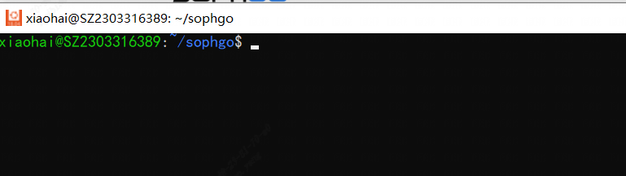

* PowerShell运行`wsl -l -v`查看安装的Linux版本与WSL版本

  如下图所示，我们安装的是Ubuntu-18.04版本的Linux系统，Version为2表示WSL2，若为1则为WSL。

  至此，我们成功在Win10中安装了WSL2版本的Ubuntu 18.04系统。

  

* PowerShell运行`wsl --version`查看安装的WSL是否为最新版本

  若输出的信息类似下面这种，说明安装的WSL2为最新的版本。**版本的不同决定了后面systemd配置是否能成功。**

  

若输出为一大堆其它的信息，则需要想办法将wsl版本升级到最新。可以尝试`wsl --update --web-download`或`wsl --update`，甚至是卸载WSL重装。一定要看到上面的图片输出信息，否则可能导致后续拉取Docker出错。

##### 方法三：安装双系统（需要设置好本地引导区）

安装方式可参考https://www.cnblogs.com/masbay/p/10745170.html

#### 2、1684X 开发板（运行环境）

==**刷机**==

*  安装串口驱动**CP210x_Windows_Drivers.zip**•，并使用串口线连接开发板（不上电也可）

【注意】如果连接了micro usb且安装了驱动，依旧无法检测到串口，可能是micro usb不是数据线，只是电源线

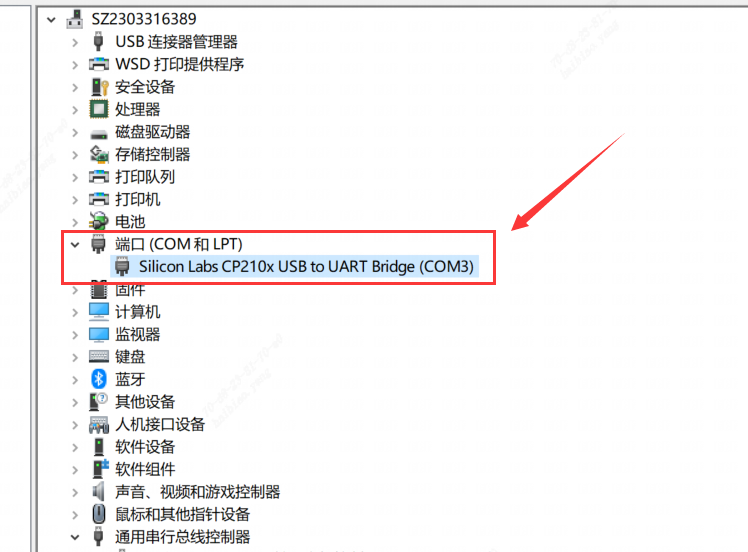

* 将开发板拨码开关设置到SOC模式

  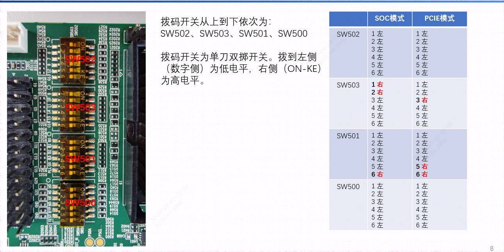

* 连接开发板并将SD卡插入卡槽

  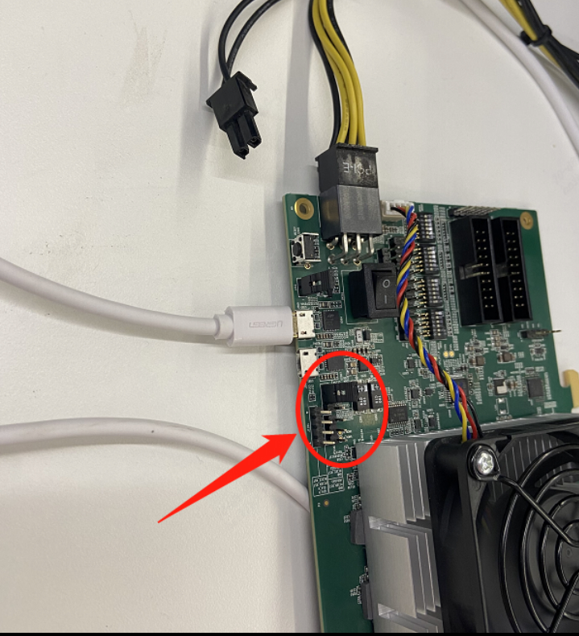

* 使用MobaXterm进行串口连接

  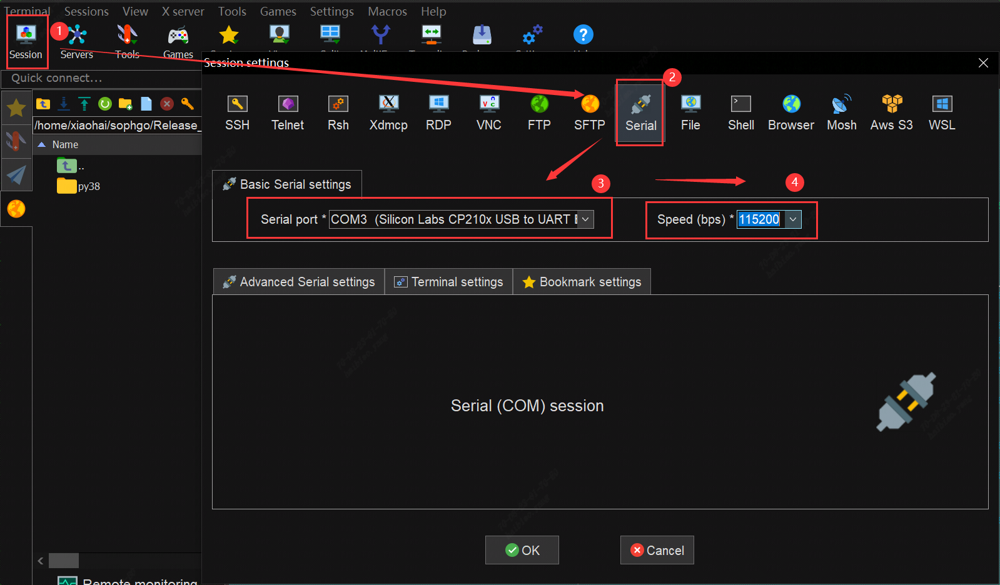

* 设备上电，会输出相关刷机过程

  

  出现以下表示刷机完成，下电，拔掉sd卡重新上电

  

  重新上电，出现以下输出信息过程：

  

  **login：** **linaro**   **password：** **linaro**

  ```shell
  #以下deb依赖包可选择性安装
  cd bsp-debs
  dpkg -i *.deb
  ```

  **==刷机完成 !==**

  ### 连接SOC设备

  * 通过本地网络适配器网线连接方式

    （1）将网线一端插在SD卡槽左边第一个的网口，另一端插入本地电脑网口

    （2）右键电脑状态栏的网络标识，进入网络适配器选项

    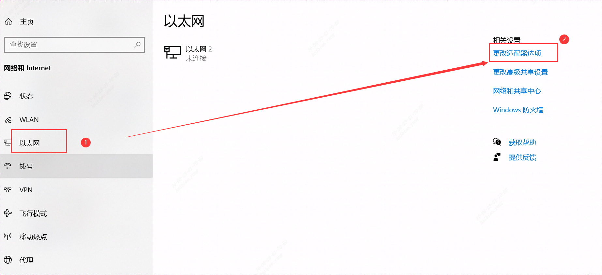

    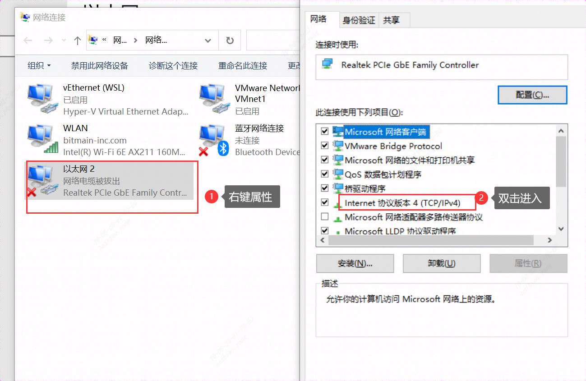

    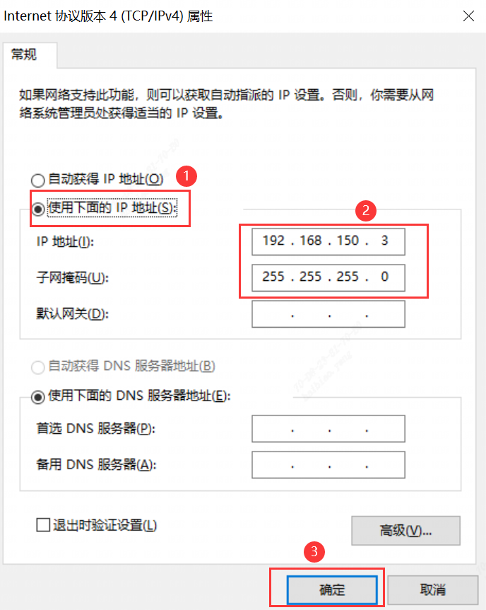

  **【IP地址】：**192.168.150.1   **【用户名】：**linaro   **【密码】：**linaro

  ```shell
  ssh linaro@192.168.150.1
  ```

  * 也可通过串口Serial连接，设置COM口，Speed为115200，即刷机完成后，重新上电即可串口连接开发板

  ==成功进入显示**linaro@bm1684**的Ubuntu系统==

  * 通过LAN口网络连接方式，IP地址：172.xxx.xxx.xxx(DHCP获取的地址，可通过串口ifconfig查看IP)，

    **【用户名】：**linaro   **【密码】：**linaro

    

## 二、软件要求

#### 1、**Docker**（*sophgo/tpuc_dev:latest）

**==方法一和方法三安装Ubuntu系统的参考以下方式加载docker==**

##### Docker 安装

```shell
# 安装docker
sudo apt-get install docker.io
# docker命令免root权限执行
# 创建docker用户组，若已有docker组会报错，没关系可忽略
sudo groupadd docker
# 将当前用户加入docker组
sudo gpasswd -a ${USER} docker
# 重启docker服务
sudo service docker restart
# 切换当前会话到新group或重新登录重启X会话
newgrp docker
```

```
提示：需要logout系统然后重新登录，再使用docker就不需要sudo了。
```

##### 创建docker容器并进入Docker

```
docker run -v $PWD/:/workspace -p 8001:8001 -it sophgo/tpuc_dev:latest
```

**==方法二按照以下方式加载Docker==**

* 更新 apt 包索引

```bash
$ sudo apt-get update
```

* 安装 apt 依赖包，用于通过HTTPS来获取仓库

```bash
$ sudo apt-get install \
    apt-transport-https \
    ca-certificates \
    curl \
    gnupg-agent \
    software-properties-common
```

* 添加 Docker 的官方 GPG 密钥

```bash
$ curl -fsSL https://mirrors.ustc.edu.cn/docker-ce/linux/ubuntu/gpg | sudo apt-key add -
```

* 使用以下指令设置稳定版仓库

```bash
$ sudo add-apt-repository \
   "deb [arch=amd64] https://mirrors.ustc.edu.cn/docker-ce/linux/ubuntu/ \
  $(lsb_release -cs) \
  stable"
```

安装后，输出如图：

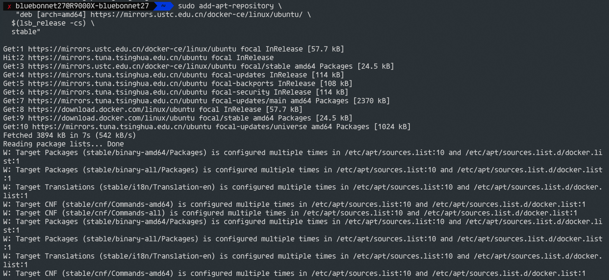

* 安装 Docker Engine-Community

我这里直接安装最新版本的 Docker Engine-Community 和 containerd，

```bash
$ sudo apt-get install docker-ce docker-ce-cli containerd.io
```

输出如图：

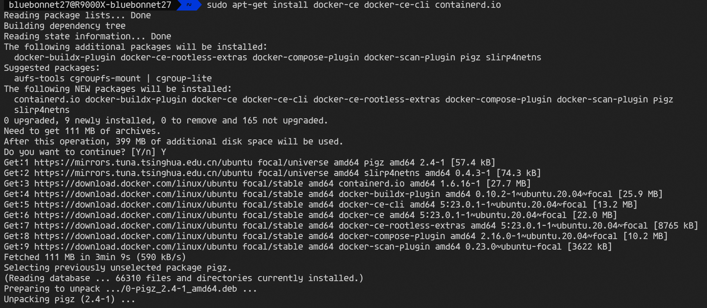

为了避免每次都加sudo，需要给现在的账户添加docker权限

* 创建docker用户组

```bash
$ sudo groupadd docker
```

* 添加当前用户到docker用户组

```bash
$ sudo usermod -aG docker $USER
```

* 退出当前shell，重新登录

* 创建docker容器并进入Docker

```
#进入到用户目录
cd ~
docker run -v $PWD/:/workspace -p 8001:8001 -it sophgo/tpuc_dev:latest
```


#### 2、**SophonSDK开发包（**V23.03.01/23.05.01**）

* [算能官网]([算能 (sophgo.com)](https://www.sophgo.com/site/index.html))下载SDK包

也可通过命令行下载：

```shell
wget https://sophon-file.sophon.cn/sophon-prod-s3/drive/23/06/15/16/Release_230501-public.zip
```

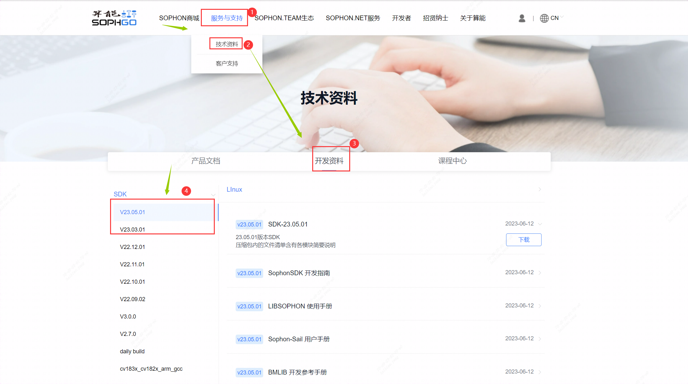

* 将下载的SophonSDK开发包进行解压：

```shell
sudo apt-get install p7zip
sudo apt-get install p7zip-full
7z x Release_230501-public.zip
cd Release_230501-public
```

#### 3、相关ssh和ftp工具：moberXterm（或者Xshell）、XFtp

* MobaXterm下载：https://mobaxterm.mobatek.net/download-home-edition.html
* Xshell下载：https://cdn.netsarang.net/v7/Xshell-latest-p
* Xftp下载：https://cdn.netsarang.net/v7/Xftp-latest-p