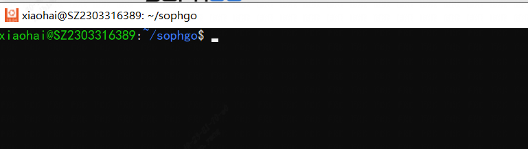
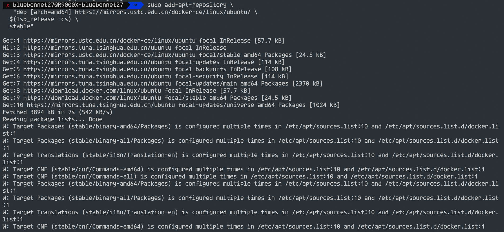
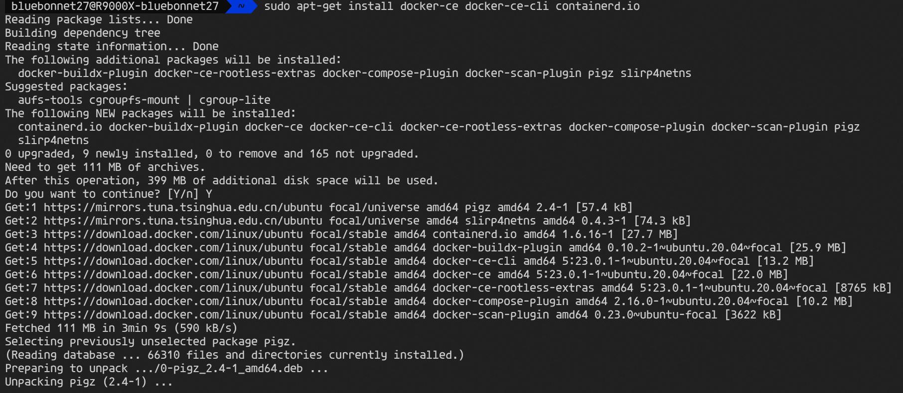

## 一、硬件要求

#### 1、准备一台安装Ubuntu16.04/18.04/20.04的x86主机

#### 	运行内存建议**12GB**以上。

这里提供三种windows主机安装ubuntu系统的方法：

##### 方法一：虚拟机VMware方式（磁盘空间要求大，入门友好）

安装方式可参考https://blog.csdn.net/weixin_43290551/article/details/125954709

https://blog.csdn.net/weixin_43928755/article/details/125780576

##### 方法二：Windows系统WSL本地搭建Ubuntu【win10系统，win11暂时对WSL不友好】


* **（1）**打开 【控制面板->程序->程序和功能->启用或关闭Windows功能】,出现如下界面，启用“**适用于Linux的Windows子系统**”与“**虚拟机平台**”两个功能。注意，千万不要漏掉“**虚拟机平台**”。

  

* **（2）**下载并安装wsl_update_x64.msi

将地址“https://wslstorestorage.blob.core.windows.net/wslblob/wsl_update_x64.msi”复制到浏览器，下载并安装**wsl_update_x64.msi**。

* **（3）**PowerShell安装组件（管理员身份运行powerShell）

  ```
  dism.exe /online /enable-feature /featurename:Microsoft-Windows-Subsystem-Linux /all /norestart
  dism.exe /online /enable-feature /featurename:VirtualMachinePlatform /all /norestart
  ```

  

* **（4）**PowerShell安装Ubuntu

  PowerShell运行`wsl --set-default-version 2`，设置默认安装WSL2版本

  

  PowerShell运行`wsl --list --online`查看可用的Linux系统版本

  

* PowerShell运行`wsl --install -d <distro name>`安装指定版本的Linux系统

  将<distro name>替换为**Ubuntu-18.04**或你对应的Ubuntu系统版本

* 安装完会弹出一个框，设置好**用户名**和**密码**，一个专属于你的Linux系统就成了。

  

* PowerShell运行`wsl -l -v`查看安装的Linux版本与WSL版本

  如下图所示，我们安装的是Ubuntu-18.04版本的Linux系统，Version为2表示WSL2，若为1则为WSL。

  至此，我们成功在Win10中安装了WSL2版本的Ubuntu 18.04系统。

  

* PowerShell运行`wsl --version`查看安装的WSL是否为最新版本

  若输出的信息类似下面这种，说明安装的WSL2为最新的版本。**版本的不同决定了后面systemd配置是否能成功。**

  

若输出为一大堆其它的信息，则需要想办法将wsl版本升级到最新。可以尝试`wsl --update --web-download`或`wsl --update`，甚至是卸载WSL重装。一定要看到上面的图片输出信息，否则可能导致后续拉取Docker出错。

##### 方法三：安装双系统（需要设置好本地引导区）

安装方式可参考https://www.cnblogs.com/masbay/p/10745170.html

#### 【注意】

ext4.vhdx 文件是 WSL 2 使用的虚拟磁盘文件，其中包含 Ubuntu 发行版的文件系统。你可以通过以下方法查看该虚拟磁盘文件中的内容：

**方法一：通过 WSL 2 运行 Ubuntu**

1. 打开 WSL 2 终端（例如，PowerShell 或 Windows 终端）。

2. 在终端中输入以下命令，以进入 Ubuntu 发行版：

   ```
   wsl
   ```
   
3. 现在你就位于 Ubuntu 发行版的命令行终端中了，你可以浏览 ext4.vhdx 中的文件和目录，就像在正常的 Linux 终端中一样。

**方法二：挂载 ext4.vhdx 到 Windows**

1. 在 Windows 中，打开 PowerShell 或命令提示符。

2. 使用 `wsl --mount` 命令将 ext4.vhdx 文件挂载到一个临时目录：

   ```
   wsl --mount D:\Users\<你的用户名>\AppData\Local\Packages\<CanonicalGroupLimited.Ubuntu18.04LTS_随机字符>\LocalState\ext4.vhdx
   ```
   

或

```
   wsl --mount D:\Users\<你的用户名>\AppData\Local\Packages\<CanonicalGroupLimited.Ubuntu20.04LTS_随机字符>\LocalState\ext4.vhdx
```

   注意：将 `<你的用户名>` 替换为你的 Windows 用户名，并根据实际情况选择 Ubuntu 18.04 或 20.04 的 ext4.vhdx 文件。

3. 现在，ext4.vhdx 文件将被挂载到 WSL 2 的根目录下的 `/mnt/wsl` 目录中，你可以在 Windows 文件资源管理器中通过路径 `\\wsl$\Ubuntu-18.04\mnt\wsl` 或 `\\wsl$\Ubuntu-20.04\mnt\wsl` 浏览 ext4.vhdx 文件中的内容。

请注意，对 ext4.vhdx 文件进行任何更改可能会导致 WSL 2 发行版无法启动或导致数据丢失。因此，请谨慎对待 ext4.vhdx 文件，如果你只是想访问 Linux 文件系统中的内容，最好使用 WSL 终端来操作。

## 二、软件要求

#### 1、**Docker**（*sophgo/tpuc_dev:latest）

**==方法一和方法三安装Ubuntu系统的参考以下方式加载docker==**

##### Docker 安装

```shell
# 安装docker
sudo apt-get install docker.io
# docker命令免root权限执行
# 创建docker用户组，若已有docker组会报错，没关系可忽略
sudo groupadd docker
# 将当前用户加入docker组
sudo gpasswd -a ${USER} docker
# 重启docker服务
sudo service docker restart
# 切换当前会话到新group或重新登录重启X会话
newgrp docker
```

```
提示：需要logout系统然后重新登录，再使用docker就不需要sudo了。
```

##### 创建docker容器并进入Docker

```
docker run -v $PWD/:/workspace -p 8001:8001 -it sophgo/tpuc_dev:latest
```

**==方法二按照以下方式加载Docker==**

* 更新 apt 包索引

```bash
$ sudo apt-get update
```

* 安装 apt 依赖包，用于通过HTTPS来获取仓库

```bash
$ sudo apt-get install \
    apt-transport-https \
    ca-certificates \
    curl \
    gnupg-agent \
    software-properties-common
```

* 添加 Docker 的官方 GPG 密钥

```bash
$ curl -fsSL https://mirrors.ustc.edu.cn/docker-ce/linux/ubuntu/gpg | sudo apt-key add -
```

* 使用以下指令设置稳定版仓库

```bash
$ sudo add-apt-repository \
   "deb [arch=amd64] https://mirrors.ustc.edu.cn/docker-ce/linux/ubuntu/ \
  $(lsb_release -cs) \
  stable"
```

安装后，输出如图：



* 安装 Docker Engine-Community

我这里直接安装最新版本的 Docker Engine-Community 和 containerd，

```bash
$ sudo apt-get install docker-ce docker-ce-cli containerd.io
```

输出如图：



为了避免每次都加sudo，需要给现在的账户添加docker权限

* 创建docker用户组

```bash
$ sudo groupadd docker
```

* 添加当前用户到docker用户组

```bash
$ sudo usermod -aG docker $USER
```

* 退出当前shell，重新登录

* 创建docker容器并进入Docker

```
docker run -v $PWD/:/workspace -p 8001:8001 -it sophgo/tpuc_dev:latest
```


#### 2、**SophonSDK开发包（**V23.03.01/23.05.01**）

[算能官网]([算能 (sophgo.com)](https://www.sophgo.com/site/index.html))下载SDK包


#### 3、moberXterm（或者Xshell）、XFtp

* MobaXterm下载：https://mobaxterm.mobatek.net/download-home-edition.html
* Xshell下载：https://cdn.netsarang.net/v7/Xshell-latest-p
* Xftp下载：https://cdn.netsarang.net/v7/Xftp-latest-p