### Docker


### Libsophon 环境搭建

【注意】libsophon 在不同的Linux发行版上提供不同类型的安装方式，请根据您的系统选择对应的方式，不要在一台机器上混用多种安装方式。

可参考如下步骤进行安装：

> ```shell
> cd libsophon_<date>_<hash>
> # 安装依赖库，只需要执行一次
> sudo apt install dkms libncurses5
> sudo dpkg -i sophon-*.deb
> # 在终端执行如下命令，或者log out再log in当前用户后即可使用bm-smi等命令
> source /etc/profile
> ```

如果您使用其它Linux系统，安装包只由一个文件构成：libsophon_<x.y.z>_$arch.tar.gz，可参考《 [libsophon使用手册](https://doc.sophgo.com/sdk-docs/v23.05.01/docs_latest_release/docs/libsophon/guide/html/index.html) 》进行安装。


### Sophon-mw 环境搭建

**在安装sophon-mw时，请确保已经安装libsophon。**

1. 如果您使用的是Debian/Ubuntu系统，安装包由四个文件构成，分别为：sophon-mw-sophon-ffmpeg_<x.y.z>_$arch.deb、sophon-mw-sophon-ffmpeg-dev_<x.y.z>_$arch.deb、sophon-mw-sophon-opencv_<x.y.z>_$arch.deb、sophon-mw-sophon-opencv-dev_<x.y.z>_$arch.deb，
2. 请选择您对应的安装文件参考如下步骤进行安装：

> ```shell
> cd sophon-mw_<date>_<hash>
> # 必须先安装sophon-mw-sophon-ffmpeg，再安装sophon-mw-sophon-opencv
> sudo dpkg -i sophon-mw-sophon-ffmpeg_<x.y.z>_*.deb sophon-mw-sophon-ffmpeg-dev_<x.y.z>_*.deb
> sudo dpkg -i sophon-mw-sophon-opencv_<x.y.z>_*.deb sophon-mw-sophon-opencv-dev_<x.y.z>_*.deb
> # 在终端执行如下命令，或者log out再log in当前用户后即可使用安装的工具
> source /etc/profile
> ```

如果您使用的是其他Linux系统，安装包为：sophon-mw_<x.y.z>_$arch.tar.gz，可参考《 [sophon-mw使用手册](https://doc.sophgo.com/sdk-docs/v23.05.01/docs_latest_release/docs/sophon-mw/manual/html/index.html) 》进行安装。

**成功安装环境依赖测试命令**

>```shell
>bm-smi
>#输出相关设备信息即为成功（没有TPU设备也会输出没有设备）
>```
>
>```shell
>bmrt_test
>#输出相关参数帮助信息即为成功
>```


### 交叉编译环境搭建

如果您希望使用SophonSDK搭建交叉编译环境，您需要用到gcc-aarch64-linux-gnu工具链，再将程序所依赖的头文件和库文件打包到soc-sdk目录中。

1. 首先安装工具链：

   > ```shell
   > sudo apt-get install gcc-aarch64-linux-gnu g++-aarch64-linux-gnu
   > ```

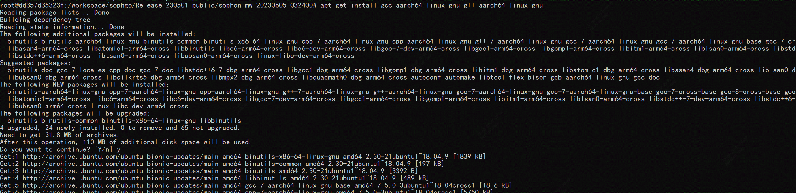

2. 解压sophon-img包里的libsophon_soc_<x.y.z>_aarch64.tar.gz，将lib和include的所有内容拷贝到soc-sdk文件夹。

> ```sh
> # 创建依赖文件的根目录
> mkdir -p soc-sdk
> cd sophon-img_<date>_<hash>
> # 解压sophon-img release包里的libsophon_soc_${x.y.z}_aarch64.tar.gz，其中x.y.z为版本号
> tar -zxf libsophon_soc_<x.y.z>_aarch64.tar.gz
> # 将相关的库目录和头文件目录拷贝到依赖文件根目录下
> cp -rf libsophon_soc_<x.y.z>_aarch64/opt/sophon/libsophon-<x.y.z>/lib ${soc-sdk}
> cp -rf libsophon_soc_<x.y.z>_aarch64/opt/sophon/libsophon-<x.y.z>/include ${soc-sdk}
> ```

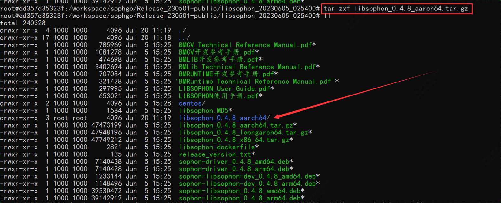

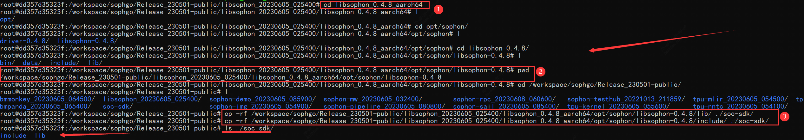

2. 解压sophon-mw包里的sophon-mw-soc_<x.y.z>_aarch64.tar.gz，将sophon-mw下lib和include的所有内容拷贝到soc-sdk文件夹。

> ```sh
> cd sophon-mw_<date>_<hash>
> # 解压sophon-mw包里的sophon-mw-soc_<x.y.z>_aarch64.tar.gz，其中x.y.z为版本号
> tar -zxf sophon-mw-soc_<x.y.z>_aarch64.tar.gz
> # 将ffmpeg和opencv的库目录和头文件目录拷贝到依赖文件根目录下
> cp -rf sophon-mw-soc_<x.y.z>_aarch64/opt/sophon/sophon-ffmpeg_<x.y.z>/lib ${soc-sdk}
> cp -rf sophon-mw-soc_<x.y.z>_aarch64/opt/sophon/sophon-ffmpeg_<x.y.z>/include ${soc-sdk}
> cp -rf sophon-mw-soc_<x.y.z>_aarch64/opt/sophon/sophon-opencv_<x.y.z>/lib ${soc-sdk}
> cp -rf sophon-mw-soc_<x.y.z>_aarch64/opt/sophon/sophon-opencv_<x.y.z>/include ${soc-sdk}
> ```

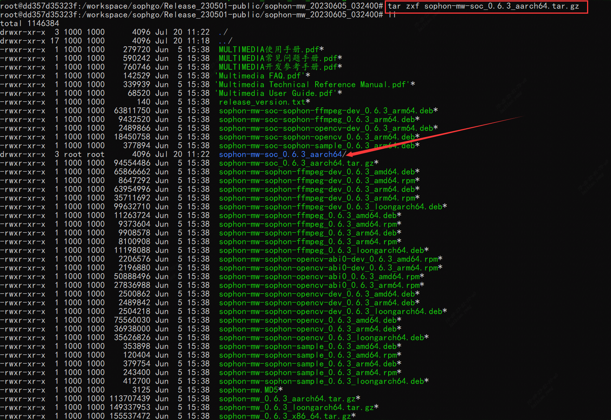

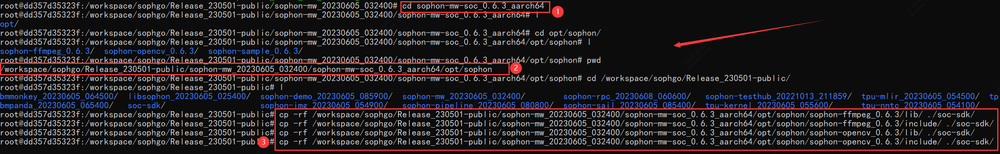

3. 如果你需要使用第三方库，可以使用qemu在x86上构建虚拟环境安装，再将头文件和库文件拷贝到soc-sdk目录中，具体可参考《 [sophon-mw使用手册](https://doc.sophgo.com/sdk-docs/v23.05.01/docs_latest_release/docs/sophon-mw/manual/html/index.html) 》。

### 验证

您可以执行以下命令，验证开发环境中的交叉编译工具链是否配置成功：

```shell
which aarch64-linux-gnu-g++
# 终端输出内容
# /usr/bin/aarch64-linux-gnu-g++
```

如果终端输出了aarch64编译的路径，则说明交叉编译工具链正确，开发环境是可以正常使用的。


### Sophon-sail编译安装

使用指定版本的python3(和目标SOC上的python3保持一致),通过交叉编译的方式,编译出包含bmcv,sophon-ffmpeg,sophon-opencv的SAIL, python3的安装方式可通过python官方网站获取, 也可以从[此链接](http://219.142.246.77:65000/sharing/8MlSKnV8x)下载已经编译好的python3。 本示例使用的python3路径为`python_3.8.2/bin/python3`,python3的动态库目录`python_3.8.2/lib`。

1. 下载sophon-sail源码,解压后进入其源码目录

2. 创建编译文件夹build,并进入build文件

   > ```shell
   > mkdir build && cd build
   > ```

3. 执行编译命令(安装路径需要更改为本地对应路径)

   > ```shell
   > cmake -DBUILD_TYPE=soc \
   > -DCMAKE_TOOLCHAIN_FILE=../cmake/BM168x_SOC/ToolChain_aarch64_linux.cmake \
   > -DPYTHON_EXECUTABLE=/workspace/sophgo/Release_230501-public/pythons/Python-3.8.2/python_3.8.2/bin/python3 \
   > -DCUSTOM_PY_LIBDIR=/workspace/sophgo/Release_230501-public/pythons/Python-3.8.2/python_3.8.2/lib/ \
   > -DLIBSOPHON_BASIC_PATH=/workspace/sophgo/Release_230501-public/libsophon_20230605_025400/libsophon_0.4.8_aarch64/opt/sophon/libsophon-0.4.8 \
   > -DFFMPEG_BASIC_PATH=/workspace/sophgo/Release_230501-public/sophon-mw_20230605_032400/sophon-mw-soc_0.6.3_aarch64/opt/sophon/sophon-ffmpeg_0.6.3 \
   > -DOPENCV_BASIC_PATH=/workspace/sophgo/Release_230501-public/sophon-mw_20230605_032400/sophon-mw-soc_0.6.3_aarch64/opt/sophon/sophon-opencv_0.6.3 \
   > ..
   > ```

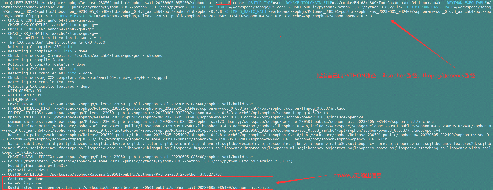

>```shell
>make pysail
>sudo make install
>```

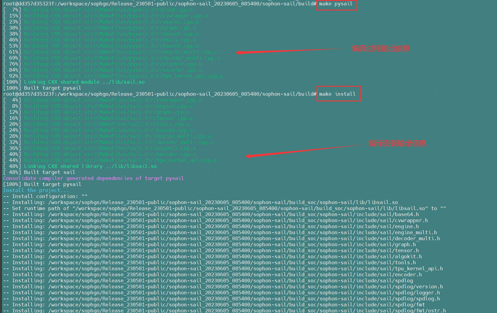

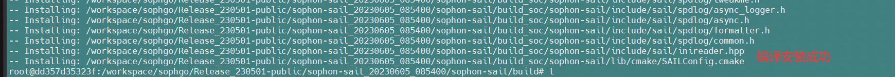

4. 打包生成python wheel,生成的wheel包的路径为`python/soc/dist`,文件名为`sophon_arm-3.5.0-py3-none-any.whl`

> ```shell
> cd ../python/soc
> chmod +x sophon_soc_whl.sh
> ./sophon_soc_whl.sh
> ```

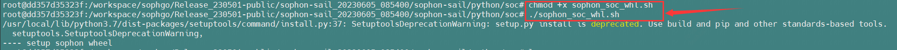

5. 安装python wheel

将`sophon_arm-3.5.0-py3-none-any.whl`**拷贝到目标SOC上**,然后执行如下安装命令

> ```shell
> pip3 install sophon_arm-3.5.0-py3-none-any.whl --force-reinstall
> ```


### SOC设备刷机

1、使用FTP工具（**mobaxterms**、**XFTP**或**FileZilla**均可）进入服务器下载刷机包

【服务器】**用户名QA **

​				**密码：SophgoRelease2022**

​				**IP：** **172.28.141.89**

在路径 /sophon-sdk/sophon-img/release_build/Release_20230327_063808/ 找到刷机包 **sdcard.tgz**

右键下载到D:\Users\[mo.li](http://mo.li/)\Downloads\

>sophon-sdk是ftp服务器中最常用的文件夹，其中保存了算丰SDK的各个历史版本
>
>SDK中包含了很多库，库文件夹下可能会包含daily_build和release_build两个文件夹。
>
>daily下的master文件夹中保存了同事每天上传更新的代码，没有人专门测试，所以无法保证稳定性。而我们需要给客户一个稳定的版本，这时候就出现一个release分支。目前是定期每个月十号左右，不同工程的负责人把master分支的修改同步到release分支。

2、挂载U盘到WSL构建的Ubuntu系统：

```sh
cd /mnt/
#创建SD卡挂载目录
sudo mkdir u/
#挂载，这里F：对应SD卡在电脑中识别的磁盘符
sudo mount -t drvfs F: /mnt/u	
#查看磁盘目录是否有挂载目录
df -h
```

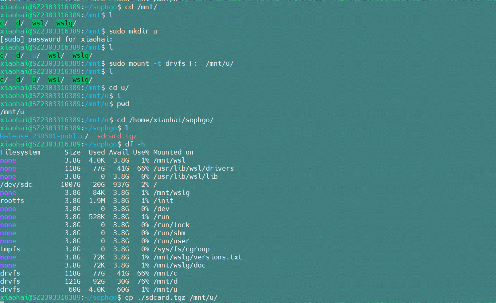

3、拷贝到sd卡  

```shell
cp ./sdcard.tgz /mnt/u 
#解压到sd卡
cd /mnt/u 
sudo tar zxf sdcard.tgz
#需要将刷机文件移动至文件夹根目录
mv ./sdcard/* ./
```

4、连接开发板（注意拨码开关设置到SOC模式）

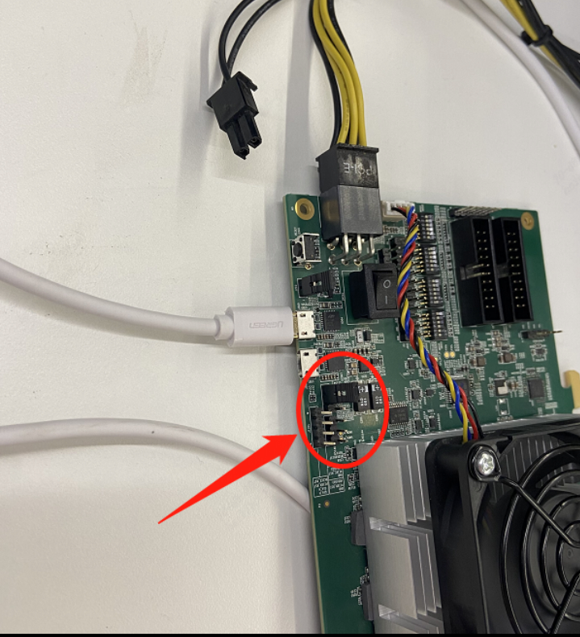

5、安装串口驱动**CP210x_Windows_Drivers.zip**

【注意】如果连接了micro usb且安装了驱动，依旧无法检测到串口，可能是micro usb不是数据线，只是电源线

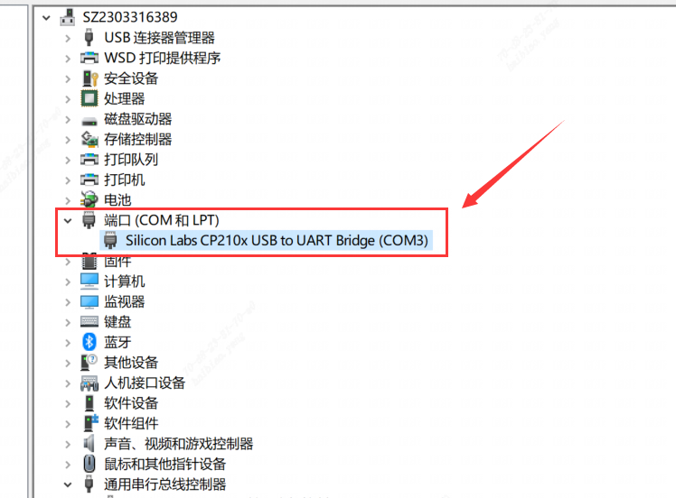

6、使用mobaxterms进入系统

使用此链接的serial连接 [Mobaxterm的使用](https://wiki.sophgo.com/pages/viewpage.action?pageId=78367456)，此时刷机包已经存在在sd卡中，连接电源自动开始刷机

【刷机过程】：


出现以下表示刷机完成，拔掉sd卡重新进入


重新上电，出现以下输出信息过程：

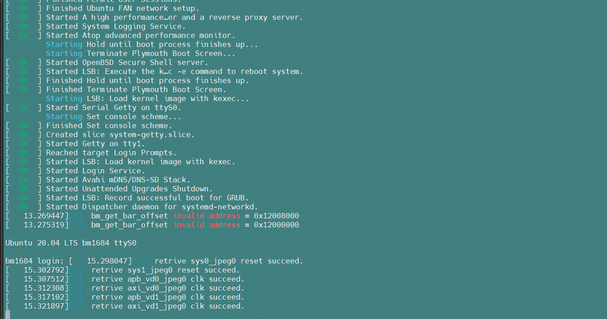

**login：** **linaro**   **password：** **linaro**

```shell
#以下deb依赖包可选择性安装
cd bsp-debs
dpkg -i *.deb
```

**==刷机完成 !==**

### 连接SOC设备

* 通过本地网络适配器网线连接方式

  **【IP地址】：**192.168.150.1   **【用户名】：**linaro   **【密码】：**linaro

```shell
ssh linaro@192.168.150.1
```

* 也可通过串口Serial连接，设置COM口，Speed为115200

==成功进入显示**linaro@bm1684**的Ubuntu系统==


C++部署测试命令

```
./yolov5_bmcv.soc --input=../../datasets/test --bmodel=../../workspace/yolov5s_1684x_f32.bmodel --dev_id=0 --conf_thresh=0.5 --nms_thresh=0.5 --obj_thresh=0.5 --classnames=../../datasets/coco.names
```

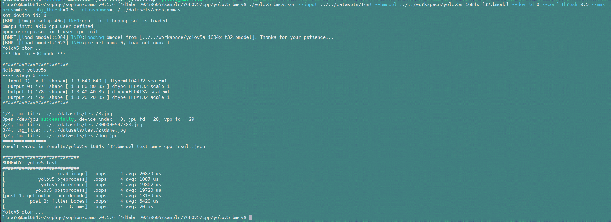