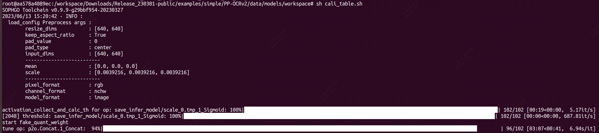
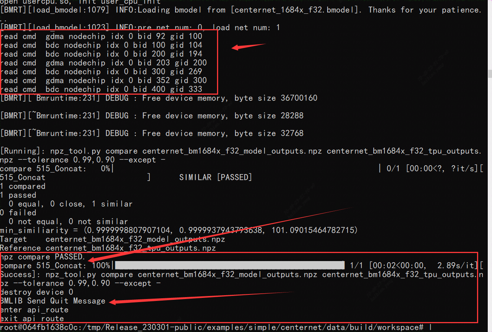
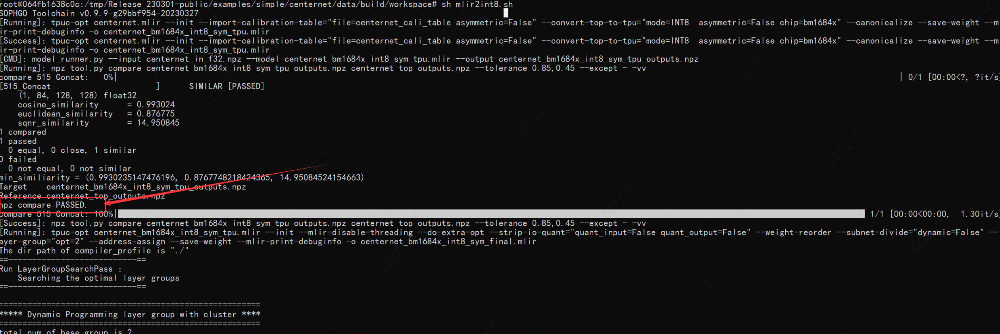

**注意： 由于SOPHGO SE5微服务器的CPU是基于ARM架构，以下步骤将在基于x86架构CPU的开发环境中完成**

* 初始化开发环境(基于x86架构CPU的开发环境中完成)
* 模型转换 (基于x86架构CPU的开发环境中完成)

处理后的PP-OCR项目文件将被拷贝至 SE5微服务器 上进行推理测试

### 开发环境配置

==**【x86架构CPU的开发环境】**==

- Linux开发环境
  1. 一台安装了Ubuntu16.04/18.04/20.04的x86主机，运行内存建议12GB以上
  2. 下载SophonSDK开发包(v23.03.01)


#### （1）解压缩SDK包

```
sudo apt-get install p7zip
sudo apt-get install p7zip-full
7z x Release_<date>-public.zip
cd Release_<date>-public
```

#### （2）Docker 安装--TPU-MLIR环境初始化

```
# 安装docker
sudo apt-get install docker.io
# docker命令免root权限执行
# 创建docker用户组，若已有docker组会报错，没关系可忽略
sudo groupadd docker
# 将当前用户加入docker组
sudo gpasswd -a ${USER} docker
# 重启docker服务
sudo service docker restart
# 切换当前会话到新group或重新登录重启X会话
newgrp docker
```

```
提示：需要logout系统然后重新登录，再使用docker就不需要sudo了。
```

#### （3）创建docker容器并进入Docker

```
docker run -v $PWD/:/workspace -p 8001:8001 -it sophgo/tpuc_dev:latest
```


#### （4）加载tpu-mlir--激活环境变量

以下操作需要在Docker容器中。关于Docker的使用, 请参考 [启动Docker Container](https://doc.sophgo.com/sdk-docs/v23.03.01/docs_latest_release/docs/tpu-mlir/quick_start/html/02_env.html#docker-container-setup) 。

```
$ tar zxf tpu-mlir_xxxx.tar.gz
$ source tpu-mlir_xxxx/envsetup.sh
```

_xxxx表示的时tpu-mlir的版本号，**==无特殊说明则均需要在docker中实现==**

==**本文是在SOPHGO PCIE 1684X/1684云平台上实现**==

>**注意：**如果是在SOPHGO提供的1684X/1684 PCIE云平台上，则无需创建和进入docker，直接加载tpu-mlir并激活环境变量即可。如下命令直接source：
>
>```
>cd tpu-mlir_xxxx/
>source tpu-mlir_xxxx-xxxx/envsetup.sh
>```


**==【以下算法移植均需要配置完环境变量后进行转换和量化】==**

### SOPHON依赖包安装

#### （1）libsophon 环境搭建

如果您使用的是Debian/Ubuntu系统，安装包由三个文件构成：`sophon-driver_<x.y.z>_$arch.deb`、`sophon-libsophon_<x.y.z>_$arch.deb`、`sophon-libsophon-dev_<x.y.z>_$arch.deb`

>其中，<x.y.z> 指版本号，$arch 指当前机器的硬件架构，使用如下命令可获取当前服务器的arch。通常x86_64机器对应的硬件架构是amd64，arm64机器对应的硬件架构是arm64。请选择您对应的安装文件进行安装。

可参考如下步骤进行安装：

```shell
$ cd Release_XXXXXX-public/
$ cd libsophon_<date>_<hash>
# 安装依赖库，只需要执行一次
$ sudo apt install dkms libncurses5
$ sudo dpkg -i sophon-*.deb
# 在终端执行如下命令，或者log out再log in当前用户后即可使用bm-smi等命令
$ source /etc/profile
```

>**检查驱动是否安装成功：**
>
>执行 `ls /dev/bm*` 看看是否有 /dev/bm-sohponX （X表示0-N），如果有表示安装成功。 正常情况下输出如下信息：
>
>/dev/bmdev-ctl /dev/bm-sophon0
>
>如果您使用其它Linux系统，安装包只由一个文件构成：libsophon_<x.y.z>_$arch.tar.gz，可参考《 [libsophon使用手册](https://doc.sophgo.com/sdk-docs/v23.03.01/docs_latest_release/docs/libsophon/guide/html/index.html) 》进行安装。
>
>其他疑问请参考《 [libsophon使用手册](https://doc.sophgo.com/sdk-docs/v23.03.01/docs_latest_release/docs/libsophon/guide/html/index.html) 》

#### （2）sophon-mw 环境搭建

**在安装sophon-mw时，请确保已经安装libsophon。**

1. 如果您使用的是Debian/Ubuntu系统，安装包由四个文件构成，分别为：`sophon-mw-sophon-ffmpeg_<x.y.z>_$arch.deb`、`sophon-mw-sophon-ffmpeg-dev_<x.y.z>_$arch.deb`、`sophon-mw-sophon-opencv_<x.y.z>_$arch.deb`、`sophon-mw-sophon-opencv-dev_<x.y.z>_$arch.deb`，请选择您对应的安装文件参考如下步骤进行安装：

   ```shell
   cd sophon-mw_<date>_<hash>
   # 必须先安装sophon-mw-sophon-ffmpeg，再安装sophon-mw-sophon-opencv
   sudo dpkg -i sophon-mw-sophon-ffmpeg_<x.y.z>_*.deb sophon-mw-sophon-ffmpeg-dev_<x.y.z>_*.deb
   sudo dpkg -i sophon-mw-sophon-opencv_<x.y.z>_*.deb sophon-mw-sophon-opencv-dev_<x.y.z>_*.deb
   # 在终端执行如下命令，或者log out再log in当前用户后即可使用安装的工具
   source /etc/profile
   ```

2. 如果您使用的是其他Linux系统，安装包为：sophon-mw_<x.y.z>_$arch.tar.gz，可参考《 [sophon-mw使用手册](https://doc.sophgo.com/sdk-docs/v23.03.01/docs_latest_release/docs/sophon-mw/manual/html/index.html) 》进行安装。

其他疑问请参考《 [sophon-mw使用手册](https://doc.sophgo.com/sdk-docs/v23.03.01/docs_latest_release/docs/sophon-mw/manual/html/index.html) 》

#### （3）交叉编译环境搭建

如果您希望使用SophonSDK搭建交叉编译环境，您需要用到gcc-aarch64-linux-gnu工具链，再将程序所依赖的头文件和库文件打包到soc-sdk目录中。

1. 首先安装工具链：

   ```shell
   $ sudo apt-get install gcc-aarch64-linux-gnu g++-aarch64-linux-gnu
   ```

2. 解压sophon-img包里的libsophon_soc_<x.y.z>_aarch64.tar.gz，将lib和include的所有内容拷贝到soc-sdk文件夹。

   ```shell
   # 创建依赖文件的根目录,在Release_XXXXXX-public目录下创建，方便查找和移植依赖包
   $ mkdir -p soc-sdk
   $ cd sophon-img_<date>_<hash>
   
   # 解压sophon-img release包里的libsophon_soc_${x.y.z}_aarch64.tar.gz，其中x.y.z为版本号
   $ tar -zxf libsophon_soc_<x.y.z>_aarch64.tar.gz
   # 将相关的库目录和头文件目录拷贝到依赖文件根目录下
   $ cp -rf libsophon_soc_<x.y.z>_aarch64/opt/sophon/libsophon-<x.y.z>/lib ../soc-sdk
   $ cp -rf libsophon_soc_<x.y.z>_aarch64/opt/sophon/libsophon-<x.y.z>/include ../soc-sdk
   ```

3. 解压sophon-mw包里的sophon-mw-soc_<x.y.z>_aarch64.tar.gz，将sophon-mw下lib和include的所有内容拷贝到soc-sdk文件夹。

   ```shell
   $ cd sophon-mw_<date>_<hash>
   # 解压sophon-mw包里的sophon-mw-soc_<x.y.z>_aarch64.tar.gz，其中x.y.z为版本号
   $ tar -zxf sophon-mw-soc_<x.y.z>_aarch64.tar.gz
   # 将ffmpeg和opencv的库目录和头文件目录拷贝到依赖文件根目录下
   $ cp -rf sophon-mw-soc_<x.y.z>_aarch64/opt/sophon/sophon-ffmpeg_<x.y.z>/lib ../soc-sdk
   $ cp -rf sophon-mw-soc_<x.y.z>_aarch64/opt/sophon/sophon-ffmpeg_<x.y.z>/include ../soc-sdk
   $ cp -rf sophon-mw-soc_<x.y.z>_aarch64/opt/sophon/sophon-opencv_<x.y.z>/lib ../soc-sdk
   $ cp -rf sophon-mw-soc_<x.y.z>_aarch64/opt/sophon/sophon-opencv_<x.y.z>/include ../soc-sdk
   ```

4. 如果你需要使用第三方库，可以使用qemu在x86上构建虚拟环境安装，再将头文件和库文件拷贝到soc-sdk目录中，具体可参考《 [sophon-mw使用手册](https://doc.sophgo.com/sdk-docs/v23.03.01/docs_latest_release/docs/sophon-mw/manual/html/index.html) 》。

5. 验证

   您可以执行以下命令，验证开发环境中的交叉编译工具链是否配置成功：

   ```
   1which aarch64-linux-gnu-g++
   2# 终端输出内容
   3# /usr/bin/aarch64-linux-gnu-g++
   ```

   如果终端输出了aarch64编译的路径，则说明交叉编译工具链正确，开发环境是可以正常使用的。

若您需要使用SAIL模块，在非SoC平台下，您需要根据使用的python版本安装相应的pip包，请参考《 [sophon-sail使用手册](https://doc.sophgo.com/sdk-docs/v23.03.01/docs_latest_release/docs/sophon-sail/docs/zh/html/) 》中的安装说明。若您在SoC平台中使用SAIL模块，只需要设置环境变量即可。

#### （4）sophon-sail 环境搭建

**源码的目录结构如下:**

```
 sophon-sail/
 |── 3rdparty
 |   ├── prebuild
 |   ├── pybind11
 |   └── spdlog
 |── cmake                     # Cmake Files
 |── docs                      # Documentation codes
 |── include                   # Includes
 |── python                    # Wheel codes
 |   ├── arm_pcie
 |   ├── pcie
 |   └── soc
 |── python_wheels             # Python Wheels
 |   ├── arm_pcie
 |   └── soc
 |── sample                    # Sample files
└── src                       # Source codes
```

其中3rdparty主要包含了编译sail需要依赖的第三方的一些头文件; cmake中是编译用到的一些cmake文件; include是sail的一些头文件; python文件夹内包含了以下各平台下面python wheel的打包代码及脚本; python_wheels文件夹内是一些预编译出来的wheel包,arm_pcie和soc两个文件夹分别是对应的平台; sample文件夹内是一些示例程序; src文件夹下面是各接口的实现代码。

**编译参数**

- BUILD_TYPE : 编译的类型,目前有pcie和soc两种模式,pcie是编译在x86主机上可用的SAIL包,soc表示使用交叉编译的方式,在x86主机上编译soc上可用的SAIL包,arm_pcie表示使用交叉编译的方式,在x86主机上编译插有bm168x卡的arm主机上可用的SAIL包。默认pcie。
- ONLY_RUNTIME : 编译结果是否只包含运行时,而不包含bmcv,sophon-ffmpeg,sophon-opencv,如果此编译选项为ON,则SAIL的编解码及Bmcv接口不可用,只有推理接口可用。默认OFF。
- INSTALL_PREFIX : 执行make install时的安装路径,pcie模式下默认“/opt/sophon”,与libsophon的安装路径一致,交叉编译模式下默认“build_soc”。
- PYTHON_EXECUTABLE : 编译使用的“python3”的路径名称(路径+名称),默认使用当前系统中默认的python3。
- CUSTOM_PY_LIBDIR : 编译使用的python3的动态库的路径(只包含路径),默认使用当前系统中默认python3的动态库目录。
- LIBSOPHON_BASIC_PATH : 交叉编译模式下,libsophon的路径,如果配置不正确则会编译失败。pcie模式下面此编译选项不生效。
- FFMPEG_BASIC_PATH : 交叉编译模式下,sophon-ffmpeg的路径,如果配置不正确,且ONLY_RUNTIME为“ON”时会编译失败。pcie模式下面此编译选项不生效。
- OPENCV_BASIC_PATH : 交叉编译模式下,sophon-opencv的路径,如果配置不正确,且ONLY_RUNTIME为“ON”时会编译失败。pcie模式下面此编译选项不生效。

```
```


##### PCIE MODE

**.安装libsophon,sophon-ffmpeg,sophon-opencv的SAIL**

libsophon,sophon-ffmpeg,sophon-opencv的安装方式可参考算能官方文档

**.典型编译方式一**

使用默认安装路径,编译包含bmcv,sophon-ffmpeg,sophon-opencv的SAIL

*如果不需要使用python接口,可以忽略5、6两个步骤*

1. 下载sophon-sail源码,解压后进入其源码目录

2. 创建编译文件夹build,并进入build文件夹

   > ```
   > mkdir build && cd build
   > ```

3. 执行编译命令

   > ```
   > cmake ..
   > make
   > ```

4. 安装SAIL动态库及头文件,编译结果将安装在‘/opt/sophon’下面

   > ```
   > sudo make install
   > ```

5. 打包生成python wheel,生成的wheel包的路径为‘python/pcie/dist’,文件名为‘sophon-3.4.0-py3-none-any.whl’

   > ```
   > cd ../python/pcie
   > chmod +x sophon_pcie_whl.sh
   > ./sophon_pcie_whl.sh
   > ```

6. 安装python wheel

   > ```
   > pip3 install ./dist/sophon-3.4.0-py3-none-any.whl --force-reinstall
   > ```

**.典型编译方式二**

使用默认安装路径,编译不包含bmcv,sophon-ffmpeg,sophon-opencv的SAIL,

*通过此方式编译出来的SAIL无法使用其Decoder、Bmcv等多媒体相关接口。*

*如果不需要使用python接口,可以忽略5、6两个步骤*

1. 下载sophon-sail源码,解压后进入其源码目录

2. 创建编译文件夹build,并进入build文件夹

   > ```
   > mkdir build && cd build
   > ```

3. 执行编译命令

   > ```
   > cmake -DONLY_RUNTIME=ON ..
   > make
   > ```

4. 安装SAIL动态库及头文件,编译结果将安装在‘/opt/sophon’下面

   > ```
   > sudo make install
   > ```

5. 打包生成python wheel,生成的wheel包的路径为‘python/pcie/dist’,文件名为‘sophon-3.4.0-py3-none-any.whl’

   > ```
   > cd ../python/pcie
   > chmod +x sophon_pcie_whl.sh
   > ./sophon_pcie_whl.sh
   > ```

6. 安装python wheel

   > ```
   > pip3 install ./dist/sophon-3.4.0-py3-none-any.whl --force-reinstall
   > ```

**.典型编译方式三**

如果生产环境与开发环境上的python3版本不一致,可以通过升级python3版本使其保持一致, 也可以通过python3的官方网站获取获取相应的python3包, 或者从[此链接](http://219.142.246.77:65000/sharing/8MlSKnV8x)下载已经编译好的python3。 也就是使用非系统默认的python3,编译包含bmcv,sophon-ffmpeg,sophon-opencv的SAIL,并打包到‘build_pcie’目录下, 本示例使用的python3路径为‘python_3.8.2/bin/python3’,python3的动态库目录‘python_3.8.2/lib’。

*如果不需要使用python接口,可以忽略6、7两个步骤,在步骤3中也可以不指定PYTHON_EXECUTABLE和CUSTOM_PY_LIBDIR*

1. 下载sophon-sail源码,解压后进入其源码目录

2. 创建编译文件夹build,并进入build文件夹

   > ```
   > mkdir build && cd build
   > ```

3. 执行编译命令

   > ```
   > cmake -DINSTALL_PREFIX=../build_pcie -DPYTHON_EXECUTABLE=python_3.8.2/bin/python3 -DCUSTOM_PY_LIBDIR=python_3.8.2/lib ..
   > make
   > ```

4. 安装SAIL动态库及头文件,程序将自动在源码目录下创建‘build_pcie’,编译结果将安装在‘build_pcie’下面

   > ```
   > make install
   > ```

5. 将‘build_pcie’文件夹下的‘sophon-sail’拷贝至生产机器上的‘/opt/sophon’目录下,然后返回编译机器进行后续操作

6. 打包生成python wheel,生成的wheel包的路径为‘python/pcie/dist’,文件名为‘sophon-3.4.0-py3-none-any.whl’

   > ```
   > cd ../python/pcie
   > chmod +x sophon_pcie_whl.sh
   > ./sophon_pcie_whl.sh
   > ```

7. 安装python wheel

将‘sophon-3.4.0-py3-none-any.whl’拷贝到目标机器上,然后执行如下安装命令

> ```
> pip3 install ./dist/sophon-3.4.0-py3-none-any.whl --force-reinstall
> ```

##### SOC MODE

参考[2. 编译安装指南 — sophon-sail v23.03.01 文档 (sophgo.com)](https://doc.sophgo.com/sdk-docs/v23.03.01/docs_latest_release/docs/sophon-sail/docs/zh/html/1_build.html#sail)

##### ARM PCIE MODE

参考[2. 编译安装指南 — sophon-sail v23.03.01 文档 (sophgo.com)](https://doc.sophgo.com/sdk-docs/v23.03.01/docs_latest_release/docs/sophon-sail/docs/zh/html/1_build.html#sail)

### 一、{paddle}实现PP-OCR的文字识别算法模型的转换和量化

### 1、模型转换

==**【x86架构CPU的开发环境】**==

#### （1）下载SOPHON示例仓库-PP-OCR算法移植代码：

```shell
git clone https://github.com/sophon-ai-algo/examples.git
# PP-OCR示例项目代码位置 /examples/simple/PP-OCRv2
```

#### （2）将checkpoints模型 转换为 inference模型

PaddlePaddle 支持导出 inference 模型用于部署推理场景，相比于训练调优场景，inference 模型会将网络权重与网络结构进行持久化存储，并且
PaddlePaddle 支持使用预测引擎加载 inference 模型进行预测推理。
参考：https://gitee.com/paddlepaddle/PaddleClas/blob/release/2.3/docs/zh_CN/inference_deployment/export_model.md
超轻量PP-OCRv2系列包含三个模型：检测（3.1M）+ 方向分类器（1.4M）+ 识别（8.5M）= 13.0M
可以直接通过运行SOPHON示例项目中的脚本下载转换好的inference模型：

通过脚本下载需要的数据和模型：

```shell
# 进入项目
cd /examples/simple/PP-OCRv2/
# 执行脚本下载数据和模型
./scripts/download.sh
```

下载过程图：


>下载的模型存放目录为  PP-OCRv2/data/models
>
>下载的模型包括：
>ch_PP-OCRv2_det_infer: 文本检测模型
>ch_PP-OCRv2_rec_infer: 文本识别模型
>ch_ppocr_mobile_v2.0_cls_infer: 文本方向分类模型
>下载的数据包括：
>ppocr_img: 用于测试的相关图片


每一个模型文件夹下都是模型权重和参数：


ppocr_img包含测试图片：


#### （3）转换为ONNX格式模型

由于目前只支持ONNX、TFLite和Caffe模型直接转换F32和Int8，PyTorch、PaddlePaddle和TensorFlow则需要转换为中间格式ONNX才能通过MLIR转换F32和Int8。

在命令行中通过以下命令安装paddle2onnx工具，并利用该工具将PaddlePaddle模型转为ONNX模型：

```shell
$ pip install paddle2onnx
$ cd /PP-OCRv2/data/models/
$ paddle2onnx  --model_dir ./ch_xxxxxxx_xxx_infer \ 
#xxx表示可以是PP-OCRv2_det也可以是rec，又或者是ppocr_mobile_v2.0_cls（即下载的几个模型文件所在文件夹）
          --model_filename inference.pdmodel \
          --params_filename inference.pdiparams \
          --opset_version 13 \
          --save_file pp_ocrv2.onnx
```

运行完以上所有命令后我们将获得一个名为pp_ocrv2.onnx的onnx模型。


#### （4）ONNX转换MLIR模型

如果模型是图片输入, 在转模型之前我们需要了解模型的预处理。如果模型用预处理后的npz文件做输入, 则不需要考虑预处理。

模型转换命令如下:

```shell
$ mkdir workspace && cd workspace
$ model_transform.py \
    --model_name pp_ocrv2 \
    --model_def ../pp_ocrv2.onnx \
    --input_shapes [[1,3,640,640]] \
    --mean 0.0,0.0,0.0 \
    --scale 0.0039216,0.0039216,0.0039216 \
    --keep_aspect_ratio \
    --pixel_format rgb \
    --test_input ../../images/ppocr_img/imgs/1.jpg \
    --test_result pp_ocrv2_top_outputs.npz \
    --mlir pp_ocrv2.mlir \
    #--post_handle_type yolo 此参数可以不加，不进行后处理，防止后边的npz文件compare时报错
```

`model_transform.py` 支持的参数如下:

| 参数名            | 必选？ | 说明                                                         |
| ----------------- | ------ | ------------------------------------------------------------ |
| model_name        | 是     | 指定模型名称                                                 |
| model_def         | 是     | 指定模型定义文件, 比如`.onnx`或`.tflite`或`.prototxt`文件    |
| input_shapes      | 否     | 指定输入的shape, 例如[[1,3,640,640]]; 二维数组, 可以支持多输入情况 |
| resize_dims       | 否     | 原始图片需要resize之后的尺寸; 如果不指定, 则resize成模型的输入尺寸 |
| keep_aspect_ratio | 否     | 在Resize时是否保持长宽比, 默认为false; 设置时会对不足部分补0 |
| mean              | 否     | 图像每个通道的均值, 默认为0.0,0.0,0.0                        |
| scale             | 否     | 图片每个通道的比值, 默认为1.0,1.0,1.0                        |
| pixel_format      | 否     | 图片类型, 可以是rgb、bgr、gray、rgbd四种情况                 |
| output_names      | 否     | 指定输出的名称, 如果不指定, 则用模型的输出; 指定后用该指定名称做输出 |
| test_input        | 否     | 指定输入文件用于验证, 可以是图片或npy或npz; 可以不指定, 则不会正确性验证 |
| test_result       | 否     | 指定验证后的输出文件                                         |
| excepts           | 否     | 指定需要排除验证的网络层的名称, 多个用,隔开                  |
| mlir              | 是     | 指定输出的mlir文件名称和路径                                 |
| post_handle_type  | 否     | 将后处理融合到模型中，指定后处理类型， 比如yolo、ssd         |

转成mlir文件后, 会生成一个 `${model_name}_in_f32.npz` 文件如下, 该文件是模型的输入文件。


#### （5）MLIR转换F32模型

将mlir文件转换成f32的bmodel, 操作方法如下:

```shell
$ vi mlir2f32.sh
#将下列命令写入到mlir2f32.sh文件中,这样方便日后代码复现
model_deploy.py \
    --mlir pp_ocrv2.mlir \
    --quantize F32 \
    --chip bm1684x \
    --test_input pp_ocrv2_in_f32.npz \
    --test_reference pp_ocrv2_top_outputs.npz \ #这一步的test_reference要和上一步的test_result保持一致
    --tolerance 0.99,0.99 \
    --model pp_ocrv2_1684x_f32.bmodel
$ sh mlir2f32.sh
```

`model_deploy.py` 的相关参数说明如下:

| 参数名               | 必选？ | 说明                                                         |
| -------------------- | ------ | ------------------------------------------------------------ |
| mlir                 | 是     | 指定mlir文件                                                 |
| quantize             | 是     | 指定默认量化类型, 支持F32/F16/BF16/INT8                      |
| chip                 | 是     | 指定模型将要用到的平台, 支持bm1684x/bm1684/cv183x/cv182x/cv181x/cv180x |
| calibration_table    | 否     | 指定校准表路径, 当存在INT8量化的时候需要校准表               |
| tolerance            | 否     | 表示 MLIR 量化后的结果与 MLIR fp32推理结果相似度的误差容忍度 |
| test_input           | 否     | 指定输入文件用于验证, 可以是图片或npy或npz; 可以不指定, 则不会正确性验证 |
| test_reference       | 否     | 用于验证模型正确性的参考数据(使用npz格式)。其为各算子的计算结果 |
| compare_all          | 否     | 验证正确性时是否比较所有中间结果, 默认不比较中间结果         |
| excepts              | 否     | 指定需要排除验证的网络层的名称, 多个用,隔开                  |
| fuse_preprocess      | 否     | 是否将预处理放入模型中做,目前只支持CV18xx系列的芯片,后面的章节会进行介绍 |
| customization_format | 否     | 指定输入到模型的图像格式,与预处理有关,一般不需要指定         |
| aligned_input        | 否     | 是否将对输入数据做对齐,只支持CV18xx系列的芯片,后面的章节会进行介绍 |
| model                | 是     | 指定输出的model文件名称和路径                                |

编译完成后, 会生成名为 `${model_name}_1684x_f32.bmodel` 的文件如下：


#### （6）MLIR转INT8模型

##### 生成校准表

转INT8模型前需要跑calibration, 得到校准表; 输入数据的数量根据情况准备100~1000张左右。

然后用校准表, 生成对称或非对称bmodel。如果对称符合需求, 一般不建议用非对称, 因为 非对称的性能会略差于对称模型。

这里用现有的20张ppocr_img的图片举例, 执行calibration:

```shell
$ vi cali_table.sh
# 将下列命令写入sh文件中，这样做方便日后命令复现
run_calibration.py pp_ocrv2.mlir \
    --dataset  ../../images/ppocr_img/imgs \
    --input_num 20 \
    -o ppocr_cali_table
$ sh cali_table.sh
```


生成校准表过程图：





运行完成后会生成名为 `${model_name}_cali_table` 的文件, 该文件用于后续编译INT8 模型的输入文件。


##### 编译为INT8对称量化模型

转成INT8对称量化模型, 执行如下命令:

```shell
$ vi mlir2int8.sh
model_deploy.py \
    --mlir pp_ocrv2.mlir \
    --quantize INT8 \
    --calibration_table ppocr_cali_table \
    --chip bm1684x \
    --test_input pp_ocrv2_in_f32.npz \
    --test_reference pp_ocrv2_top_outputs.npz \
    --tolerance 0.85,0.45 \
    --model pp_ocrv2_1684x_int8_sym.bmodel
$ sh mlir2int8.sh
```

转换过程输出内容如下：


最终生成`${model_name}_1684x_int8_sym.bmodel`等相关文件如下：


##### 编译为INT8非对称量化模型

转成INT8非对称量化模型, 执行如下命令:

```shell
$ model_deploy.py \
    --mlir pp_ocrv2.mlir \
    --quantize INT8 \
    --asymmetric \
    --calibration_table ppocr_cali_table \
    --chip bm1684x \
    --test_input pp_ocrv2_in_f32.npz \
    --test_reference pp_ocrv2_top_outputs.npz \
    --tolerance 0.90,0.55 \
    --model pp_ocrv2_1684x_int8_asym.bmodel
```


编译完成后, 会生成名为 `${model_name}_1684x_int8_asym.bmodel` 的文件。


### 2、效果对比与性能测试-1684X PCIE

下载的git仓库中已经包含PP_OCRv2所需的py运行文件

#### 文本检测   `det_cv_cv_sail.py` 

主要用于检测图片中文本字段的位置，返回文本字段所在的四边形顶点坐标。
det_cv_cv_sail.py 的参数说明如下：

```
usage:det_cv_cv_sail.py [--tpu_id] [--img_path] [--det_model] [--det_batch_size] [--det_limit_side_len]
--tpu_id: 用于推理的tpu设备id;
--img_path: 输入图片文件夹的路径;
--det_model: 用于推理的文本检测bmodel路径;
--det_batch_size: 模型输入的batch_size，本例程可支持1或4;
--det_limit_side_len: 网络输入尺寸列表，本例程的模型支持640。#和上面生成mlir及npz文件的input保持一致
```

测试命令：
```shell
$ cd ../../inference/python/
$ python3 det_cv_cv_sail.py --img_path ../../data/images/ppocr_img/test --det_model ../../data/models/workspace/pp_ocrv2_1684x_XXXX.bmodel #XXXX可以时F32、int8(对称或非对称)
```


执行完成后，会将预测的可视化结果保存在` ./inference_results `文件夹下。

结果展示：


####  文本方向分类 `cls_cv_cv_sail.py `

**文本识别        `rec_cv_cv_sail.py`**

**全流程测试   `system_cv_cv_sail.py`**

**bmodel性能测试**

安装好 `libsophon` 后, 可以使用 `bmrt_test` 来测试编译出的 `bmodel` 的正确 性及性能。可以根据 `bmrt_test` 输出的性能结果, 来估算模型最大的fps, 来选择合适的模型。

```shell
#进入到bmodel所在文件夹位置
$ cd /Release_230301-public/examples/simple/PP-OCRv2/data/models/workspace
bmrt_test --bmodel pp_ocrv2_1684x_f32.bmodel #以f32的bmodel为例，也可以测试int8等
```

```
#输出信息
[BMRT][deal_with_options:1446] INFO:Loop num: 1
[BMRT][bmrt_test:723] WARNING:setpriority failed, cpu time might flutuate.
[BMRT][bmcpu_setup:349] INFO:cpu_lib 'libcpuop.so' is loaded.
bmcpu init: skip cpu_user_defined
open usercpu.so, init user_cpu_init
[BMRT][load_bmodel:1079] INFO:Loading bmodel from [pp_ocrv2_1684x_f32.bmodel]. Thanks for your patience...
[BMRT][load_bmodel:1023] INFO:pre net num: 0, load net num: 1
[BMRT][show_net_info:1463] INFO: ########################
[BMRT][show_net_info:1464] INFO: NetName: pp_ocrv2, Index=0
[BMRT][show_net_info:1466] INFO: ---- stage 0 ----
[BMRT][show_net_info:1475] INFO:   Input 0) 'x' shape=[ 1 3 640 640 ] dtype=FLOAT32 scale=1 zero_point=0
[BMRT][show_net_info:1485] INFO:   Output 0) 'save_infer_model/scale_0.tmp_1_Sigmoid' shape=[ 1 1 640 640 ] dtype=FLOAT32 scale=1 zero_point=0
[BMRT][show_net_info:1488] INFO: ########################
[BMRT][bmrt_test:782] INFO:==> running network #0, name: pp_ocrv2, loop: 0
[BMRT][bmrt_test:868] INFO:reading input #0, bytesize=4915200
[BMRT][print_array:706] INFO:  --> input_data: < 0 0 0 0 0 0 0 0 0 0 0 0 0 0 0 0 ... > len=1228800
[BMRT][bmrt_test:1005] INFO:reading output #0, bytesize=1638400
[BMRT][print_array:706] INFO:  --> output ref_data: < 0 0 0 0 0 0 0 0 0 0 0 0 0 0 0 0 ... > len=409600
[BMRT][bmrt_test:1039] INFO:net[pp_ocrv2] stage[0], launch total time is 12379 us (npu 12282 us, cpu 97 us)
[BMRT][bmrt_test:1042] INFO:+++ The network[pp_ocrv2] stage[0] output_data +++
[BMRT][print_array:706] INFO:output data #0 shape: [1 1 640 640 ] < 2.09796e-15 2.01716e-15 1.71889e-15 4.49986e-16 1.04319e-15 1.25751e-15 2.36719e-16 4.84238e-17 1.23801e-16 1.4415e-16 6.67002e-18 1.31022e-18 2.72211e-17 3.13962e-17 7.14206e-18 1.47024e-18 ... > len=409600
[BMRT][bmrt_test:1083] INFO:load input time(s): 0.004455
[BMRT][bmrt_test:1084] INFO:calculate  time(s): 0.012380
[BMRT][bmrt_test:1085] INFO:get output time(s): 0.000840
[BMRT][bmrt_test:1086] INFO:compare    time(s): 0.000198
```

### paddle框架转换-问题及解决方法

==【问题】==npz文件找不到或者报错error:npz_tool.py RuntimeError等。

【解决办法】首先检查`deploy.py`的test_result的输出npz文件名和转换F32时的test_reference的npz文件名称保持一致；其次检查输如shape等参数信息的一致性。


==【问题】==使用命令`python det_cv_cv_sail.py`时提示没有sail模块


【解决方法】

**（1）**按照环境搭建中正确安装SAIL包，如果是在PCIE MODE且需要libsophon、sophon-opencv、sophon-ffmpeg就按照安装方式一进行编译安装，如果是SOC则安装SOC MODE中进行编译安装

安装后运行测试

```shell
$ python3 #进入Python解释器
>>> import sophon.sail
#报错
Traceback (most recent call last):
  File "<stdin>", line 1, in <module>
ImportError: /opt/sophon/sophon-opencv-latest/lib/libopencv_core.so.4.1: undefined symbol: bmcpu_get_cpu_status
```


**（2）**确保库文件的权限正确：确保你对 `libopencv_core.so.4.1` 库文件具有读取权限。可以使用以下命令检查和修改权限：

```shell
ll -l /opt/sophon/sophon-opencv-latest/lib/libopencv_core.so.4.1
chmod +r /opt/sophon/sophon-opencv-latest/lib/libopencv_core.so.4.1
```

1. 检查其他依赖项：`libopencv_core.so.4.1` 可能还依赖其他库文件。请使用 `ldd` 命令检查库文件的所有依赖项，并确保它们都正确安装并在可访问的路径中。例如：

   ```shell
   ldd /opt/sophon/sophon-opencv-latest/lib/libopencv_core.so.4.1
   ```

2. 检查是否存在冲突的库版本：在某些情况下，可能会存在不兼容的库版本或冲突。确保你的系统中没有其他版本的 `libopencv_core.so` 或与之相关的库文件。如果存在冲突的库文件，尝试卸载或禁用它们，并重新运行你的程序。

3. 更新或重新安装库文件：尝试更新或重新安装 `libopencv_core.so.4.1` 库文件，以确保它是最新的且没有损坏。你可以从官方渠道或合适的软件源获取正确的库文件，并按照它们的安装说明进行操作。

4. 检查软件包版本兼容性：确认你正在使用的软件包与 `libopencv_core.so.4.1` 库文件兼容。如果软件包版本过旧或过新，可能会导致符号未定义的错误。尝试升级软件包或回退到与库文件兼容的版本。


检查 `libopencv_core.so.4.1.0-sophon-0.6.0` 的依赖项：运行以下命令检查库文件的依赖项是否正确安装：

```shell
ldd /opt/sophon/sophon-opencv-latest/lib/libopencv_core.so.4.1.0-sophon-0.6.0
```

确保所有依赖项都存在且可访问。

**（3）**检查其他库文件：确认其他相关的 OpenCV 库文件是否正确安装，并且与 `libopencv_core.so.4.1` 版本相匹配。确保你使用的是同一版本的库文件。

`libopencv_core.so.4.1.0-sophon-0.6.0` 的依赖项如下：

- libdl.so.2
- libpthread.so.0
- librt.so.1
- libavutil.so.56
- libbmcv.so.0
- libbmlib.so.0
- libstdc++.so.6
- libm.so.6
- libgcc_s.so.1
- libc.so.6
- libbmjpuapi.so.0
- libbmjpulite.so.0

请确保这些依赖项都已正确安装，并且可以在系统中找到。如果任何依赖项缺失或路径不正确，可能会导致 `undefined symbol` 错误。

**（4）**设置 `$LD_LIBRARY_PATH` 环境变量，你可以按照以下步骤进行操作：

1. 打开终端或命令提示符窗口。
2. 确定你要设置的路径。假设你的 `libopencv_core.so.4.1` 库所在的路径是 `/opt/sophon/sophon-opencv-latest/lib/`，那么这就是你要添加到 `$LD_LIBRARY_PATH` 的路径。

同时还有sophon-ffmpeg、libsophon、bmcpu等依赖包文件添加到环境变量，进入/opt/sophon/文件夹下看到相关依赖文件，将所需的依赖包添加进环境变量


1. 使用以下命令设置 `$LD_LIBRARY_PATH` 环境变量，将路径替换为你的实际路径：

   - 在 Linux 或 macOS 上：

     ```shell
     export LD_LIBRARY_PATH=/opt/sophon/sophon-opencv-latest/lib/:$LD_LIBRARY_PATH
     export LD_LIBRARY_PATH=/opt/sophon/sophon-ffmpeg-latest/lib/:$LD_LIBRARY_PATH
     export LD_LIBRARY_PATH=/opt/sophon/opencv-bmcpu-latest/:$LD_LIBRARY_PATH
     export LD_LIBRARY_PATH=/opt/sophon/libsophon-current/lib/:$LD_LIBRARY_PATH
     ```

   - 在 Windows 上（使用 PowerShell）：

     ```shell
     $env:LD_LIBRARY_PATH = "/opt/sophon/sophon-opencv-latest/lib/;$env:LD_LIBRARY_PATH"
     $env:LD_LIBRARY_PATH = "/opt/sophon/sophon-ffmpeg-latest/lib/;$env:LD_LIBRARY_PATH"
     $env:LD_LIBRARY_PATH = "/opt/sophon/opencv-bmcpu-latest/;$env:LD_LIBRARY_PATH"
     $env:LD_LIBRARY_PATH = "/opt/sophon/libsophon-current/lib/;$env:LD_LIBRARY_PATH"
     ```

   - 在 Windows 上（使用命令提示符）：

     ```shell
     set LD_LIBRARY_PATH=/opt/sophon/sophon-opencv-latest/lib/;%LD_LIBRARY_PATH%
     set LD_LIBRARY_PATH=/opt/sophon/sophon-ffmpeg-latest/lib/;%LD_LIBRARY_PATH%
     set LD_LIBRARY_PATH=/opt/sophon/opencv-bmcpu-latest/;%LD_LIBRARY_PATH%
     set LD_LIBRARY_PATH=/opt/sophon/libsophon-current/lib/;%LD_LIBRARY_PATH%
     ```

   请确保将路径设置为 `libopencv_core.so.4.1` 库所在的实际路径，并确保在设置时保留原有的环境变量值（`$LD_LIBRARY_PATH` 或 `%LD_LIBRARY_PATH%`）。

2. 确认 `$LD_LIBRARY_PATH` 是否已成功设置。在终端或命令提示符中运行以下命令：

   - 在 Linux 或 macOS 上：

     ```shell
     echo $LD_LIBRARY_PATH
     ```

   - 在 Windows 上（使用 PowerShell）：

     ```shell
     echo $env:LD_LIBRARY_PATH
     ```

   - 在 Windows 上（使用命令提示符）：

     ```shell
     echo %LD_LIBRARY_PATH%
     ```

   检查输出是否包含了你刚刚设置的路径。

请注意，上述设置只在当前终端或命令提示符会话中生效。如果你希望永久性地设置 `$LD_LIBRARY_PATH`，你需要将上述设置命令添加到你的操作系统的配置文件中（例如 `~/.bashrc` 或 `~/.bash_profile`），这样每次启动终端时都会自动应用该设置。

运行测试：

```
$ python3 #进入Python解释器
>>> import sophon.sail
```


模型运行测试：

运行`det_cv_cv_sail.py`


提示`OSError: Could not find library geos_c or load any of its variants ['libgeos_c.so.1', 'libgeos_c.so']`

```shell
#安装GEOS库：确保在您的系统上安装了GEOS库。该库提供对几何操作的支持，通常由处理空间数据的应用程序使用。您通常可以使用特定于操作系统的软件包管理器来安装它。例如，在Ubuntu上，您可以运行
$ sudo apt-get install libgeos-dev
#检查库路径：确保库的路径正确配置。您可以检查系统的库搜索路径，以确保它包含GEOS库所在的目录。您可以通过#设置LD_LIBRARY_PATH环境变量来指定库的路径，例如`export #LD_LIBRARY_PATH=/path/to/geos_library`，将`/path/to/geos_library`替换为GEOS库的实际路径。
3. 更新库缓存：命令来刷新库缓存，使系统能够找到新安装的库。
$ sudo ldconfig
```

**完美运行**


### 二、{pytorch}实现CenterNet图像分割算法模型的转换和量化

### 1、模型转换

#### （1）下载CenterNet算法移植代码：
```shell
$ git clone https://github.com/sophon-ai-algo/examples.git
# CenterNet示例项目代码位置 /examples/simple/centernet
```

获取主干网的预训练模型，运行如下命令下载 dlav0 作为主干网的预训练模型：

```shell
$ apt update  #权限不足则加上sudo
$ apt install curl
$ cd ${centernet}/data/scripts
# 下载 ctdet_coco_dlav0_1x.pth 模型文件到路径 ${centernet}/data/bulid 目录下
$ ./download_pt.sh
```

#### （2）将pth文件转换为ONNX格式模型

```shell
$ cd ${centernet}/data/bulid
$ vi export_onnx.py
#将以下信息写入py文件中
from model import create_model, load_model
import torch

if __name__ == '__main__':
    num_classes = 80
    head_conv   = 256
    heads = {'hm': num_classes,
             'wh': 2 ,
             'reg': 2}
    device = 'cpu'
    load_model_path = 'ctdet_coco_dlav0_1x.pth'
    #save_script_pt  = 'ctdet_coco_dlav0_1x.torchscript.pt'

    model = create_model('dlav0_34', heads, head_conv)
    model = load_model(model, load_model_path)
    model = model.to(device)
    model.eval()
    #input_var = torch.zeros([1, 3, 512, 512], dtype=torch.float32)
    #traced_script_module = torch.jit.trace(model, input_var)
    #traced_script_module.save(save_script_pt)
    #traced_script_module = torch.jit.load(save_script_pt)
    #print('{} exported'.format(save_script_pt))
# Prepare input tensor

    input = torch.randn(1, 3, 512, 512, requires_grad=True)


# Export the torch model as onnx

    torch.onnx.export(model,

                     input,

                     'centernet.onnx', # name of the exported onnx model

                     opset_version=13,

                     export_params=True,

                     do_constant_folding=True)

#将保存的py文件运行
$ python3 export_onnx.py
# 输出信息：
[DEBUG]arch is: dlav0
loaded ctdet_coco_dlav0_1x.pth, epoch 140
#centernet.onnx文件生成在路径 ${centernet}/data/models 下
```


#### （3）ONNX转换MLIR模型

如果模型是图片输入, 在转模型之前我们需要了解模型的预处理。如果模型用预处理后的npz文件做输入, 则不需要考虑预处理。参考yolov5s的rgb图片，mean和scale对应为 `0.0,0.0,0.0` 和 `0.0039216,0.0039216,0.0039216` 。

模型转换命令如下:

```shell
$ mkdir workspace && cd workspace
$ vi onnx2mlir.sh
#将下面的运行指令写入sh文件，方便复现和整理代码
$ model_transform.py \
    --model_name centernet \
    --model_def ../centernet.onnx \
    --input_shapes [[1,3,512,512]] \
    --mean 0.0,0.0,0.0 \
    --scale 0.0039216,0.0039216,0.0039216 \
    --keep_aspect_ratio \
    --pixel_format rgb \
    --test_input ../../images/000000000139.jpg \
    --test_result centernet_top_outputs.npz \
    --mlir centernet.mlir \
    #--post_handle_type yolo 此参数可以不加，不进行后处理，防止后边的npz文件compare时报错
$ sh onnx2mlir.sh
```


最终生成文件如下：


#### （4）MLIR转换F32模型

将mlir文件转换成f32的bmodel, 操作方法如下:

```shell
$ vi mlir2f32.sh
#将下列命令写入到mlir2f32.sh文件中,这样方便日后代码复现
model_deploy.py \
    --mlir centernet.mlir \
    --quantize F32 \
    --chip bm1684x \
    --test_input centernet_in_f32.npz \
    --test_reference centernet_top_outputs.npz \ #这一步的test_reference要和上一步的test_result保持一致
    --tolerance 0.99,0.99 \
    --model centernet_1684x_f32.bmodel
$ sh mlir2f32.sh
```




最终生成文件如下：


#### （5）MLIR转INT8模型

##### 生成校准表

转INT8模型前需要跑calibration, 得到校准表; 输入数据的数量根据情况准备100~1000张左右。

然后用校准表, 生成对称或非对称bmodel。如果对称符合需求, 一般不建议用非对称, 因为 非对称的性能会略差于对称模型。

这里用现有的200张coco的val2017的图片举例, 执行calibration:

```shell
$ vi cali_table.sh
# 将下列命令写入sh文件中，这样做方便日后命令复现
run_calibration.py centernet.mlir \
    --dataset  ../../images \
    --input_num 200 \
    -o centernet_cali_table
$ sh cali_table.sh
```


##### 编译为INT8对称量化模型

转成INT8对称量化模型, 执行如下命令:

```shell
$ vi mlir2int8.sh
model_deploy.py \
    --mlir centernet.mlir \
    --quantize INT8 \
    --calibration_table centernet_cali_table \
    --chip bm1684x \
    --test_input centernet_in_f32.npz \
    --test_reference centernet_top_outputs.npz \
    --tolerance 0.85,0.45 \
    --model centernet_1684x_int8_sym.bmodel
$ sh mlir2int8.sh
```

转换过程输出内容如下：




最终生成文件如下：


##### 编译为INT8非对称量化模型

转成INT8非对称量化模型, 执行如下命令:

```shell
$ model_deploy.py \
    --mlir centernet.mlir \
    --quantize INT8 \
    --asymmetric \
    --calibration_table centernet_cali_table \
    --chip bm1684x \
    --test_input centernet_in_f32.npz \
    --test_reference centernet_top_outputs.npz \
    --tolerance 0.90,0.55 \
    --model centernet_1684x_int8_asym.bmodel
```

### 2、效果对比与性能测试-1684X PCIE

进入centernet模型仓库中py文件所在位置，运行测试bmodel检测结果

```shell
#进入centernet模型python文件位置
$ cd /Release_230301-public/examples/simple/centernet/py_bmcv_sail
#效果测试
$ python det_centernet_bmcv_sail_1b_4b.py --input ../data/ctdet_test.jpg --bmodel ../data/build/workspace/centernet_1684x_f32.bmodel
```


预测图片结果并查看：


**bmodel性能测试**

安装好 `libsophon` 后, 可以使用 `bmrt_test` 来测试编译出的 `bmodel` 的正确 性及性能。可以根据 `bmrt_test` 输出的性能结果, 来估算模型最大的fps, 来选择合适的模型。

```shell
#进入到bmodel所在文件夹位置
$ cd /Release_230301-public/examples/simple/centernet/data/build/workspace
bmrt_test --bmodel centernet_1684x_f32.bmodel #以f32的bmodel为例，也可以测试int8等
```

```
#输出信息
[BMRT][deal_with_options:1446] INFO:Loop num: 1
[BMRT][bmrt_test:723] WARNING:setpriority failed, cpu time might flutuate.
[BMRT][bmcpu_setup:349] INFO:cpu_lib 'libcpuop.so' is loaded.
bmcpu init: skip cpu_user_defined
open usercpu.so, init user_cpu_init
[BMRT][load_bmodel:1079] INFO:Loading bmodel from [centernet_1684x_f32.bmodel]. Thanks for your patience...
[BMRT][load_bmodel:1023] INFO:pre net num: 0, load net num: 1
[BMRT][show_net_info:1463] INFO: ########################
[BMRT][show_net_info:1464] INFO: NetName: centernet, Index=0
[BMRT][show_net_info:1466] INFO: ---- stage 0 ----
[BMRT][show_net_info:1475] INFO:   Input 0) 'input.1' shape=[ 1 3 512 512 ] dtype=FLOAT32 scale=1 zero_point=0
[BMRT][show_net_info:1485] INFO:   Output 0) '515_Concat' shape=[ 1 84 128 128 ] dtype=FLOAT32 scale=1 zero_point=0
[BMRT][show_net_info:1488] INFO: ########################
[BMRT][bmrt_test:782] INFO:==> running network #0, name: centernet, loop: 0
[BMRT][bmrt_test:868] INFO:reading input #0, bytesize=3145728
[BMRT][print_array:706] INFO:  --> input_data: < 0 0 0 0 0 0 0 0 0 0 0 0 0 0 0 0 ... > len=786432
[BMRT][bmrt_test:1005] INFO:reading output #0, bytesize=5505024
[BMRT][print_array:706] INFO:  --> output ref_data: < 0 0 0 0 0 0 0 0 0 0 0 0 0 0 0 0 ... > len=1376256
[BMRT][bmrt_test:1039] INFO:net[centernet] stage[0], launch total time is 55216 us (npu 55135 us, cpu 81 us)
[BMRT][bmrt_test:1042] INFO:+++ The network[centernet] stage[0] output_data +++
[BMRT][print_array:706] INFO:output data #0 shape: [1 84 128 128 ] < -5.44699 -6.73102 -8.15043 -8.61082 -9.36364 -9.72045 -10.5258 -10.805 -11.3242 -11.2517 -11.8261 -11.7891 -12.2917 -12.0212 -11.8811 -11.14 ... > len=1376256
[BMRT][bmrt_test:1083] INFO:load input time(s): 0.002188
[BMRT][bmrt_test:1084] INFO:calculate  time(s): 0.055219
[BMRT][bmrt_test:1085] INFO:get output time(s): 0.002644
[BMRT][bmrt_test:1086] INFO:compare    time(s): 0.001170
```


### pytoch框架转换-问题及解决方法

【问题】mlir转换非对称int8时报错


【问题】runtime error 生成校准表过程输入报错

【解决办法】生成校准表时需要确保输出的数据是模型的测试集，测试集可从模型仓库中下载。


【问题】机器运行内存爆掉，导致进程被系统直接Killed

【解决办法】增加本地运行内存或者更换内存大的机器运行，或者在云平台上运行


