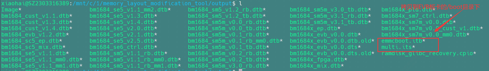

# ChatGLM2-TPU

本项目实现BM1684X部署语言大模型[ChatGLM2-6B](https://huggingface.co/THUDM/chatglm2-6b)。通过[TPU-MLIR](https://github.com/sophgo/tpu-mlir)编译器将模型转换成bmodel，并采用c++代码将其部署到BM1684X的PCIE环境，或者SoC环境。

下文中默认是PCIE环境；如果是SoC环境，按提示操作即可。

在知乎上写了关于`ChatGLM2-6B`的解读，方便大家理解源码：

[ChatGLM2-6B流程解析与TPU-MLIR部署](https://zhuanlan.zhihu.com/p/641975976)


## 开发环境


1. 下载docker，启动容器，如下：

``` shell
cd ~
docker pull sophgo/tpuc_dev:latest

# chatglm2是docker容器名称，可以自拟
docker run --privileged --name chatglm2 -v $PWD:/workspace -it sophgo/tpuc_dev:latest
```

==**后文假定环境都在docker的`/workspace`目录。**==

如果是要在==`SoC`环境运行==，则需要安装如下库：`PCIe`则跳过

``` shell
apt-get install gcc-aarch64-linux-gnu g++-aarch64-linux-gnu
```

2. 下载`ChatGLM2-6B`，比较大，会花较长时间

``` shell
cd /workspace
git lfs install
git clone git@hf.co:THUDM/chatglm2-6b
```

下载后的文件：（==**bin文件不可少**==）


并对该工程做两点修改，
一是将`config.json`文件中`seq_length`配置为512；
二是将`modeling_chatglm.py`文件中的如下代码：

```python
if attention_mask is not None:
    attention_scores = attention_scores.masked_fill(attention_mask, float("-inf"))
```

修改为：

```python
if attention_mask is not None:
    attention_scores = attention_scores + (attention_mask * -10000.0)
```


这样修改可以提升效率，使用`masked_fill`效率低下；另一方面`masked_fill`转ONNX存在些bug。

3. 下载`TPU-MLIR`代码并编译（==**也可以直接下载编译好的release SDK包解压**==）

``` shell
cd /workspace
git clone git@github.com:sophgo/tpu-mlir.git
cd tpu-mlir
source ./envsetup.sh
./build.sh
```

4. 下载[sentencepiece](https://github.com/google/sentencepiece)，并编译

```shell
cd /workspace
git clone git@github.com:google/sentencepiece.git
cd sentencepiece
mkdir build
cd build
cmake ..
make -j
```


如果要编译==`SoC`环境==，则需要在`CMakeLists.txt`加入如下代码：

```cmake
set(CMAKE_C_COMPILER aarch64-linux-gnu-gcc)
set(CMAKE_ASM_COMPILER aarch64-linux-gnu-gcc)
set(CMAKE_CXX_COMPILER aarch64-linux-gnu-g++)
```

5. 下载libsophon库并安装

在算能官网<https://developer.sophgo.com/site/index/material/all/all.html>可以找到SDK最新版本，如下：

```shell
cd /workspace
wget https://sophon-file.sophon.cn/sophon-prod-s3/drive/23/06/15/16/Release_230501-public.zip
```

解压sdk后安装libsophon，如下：

```shell
apt install sophon-libsophon_0.4.8_amd64.deb
apt install sophon-libsophon-dev_0.4.8_amd64.deb
```

注意如果是SoC环境则安装arm64版本`sophon-libsophon-dev_0.4.8_arm64.deb`

6. 下载本项目`ChatGLM2-TPU`，如下：

``` shell
cd /workspace
git clone git@github.com:sophgo/ChatGLM2-TPU.git
```

## 编译模型

1. 指定`ChatGLM2-6B`的python路径

``` shell
export PYTHONPATH=/workspace/chatglm2-6b:$PYTHONPATH
```

2. 导出所有onnx模型，如果过程中提示缺少某些组件，直接`pip install 组件`即可

``` shell
cd /workspace/ChatGLM2-TPU/compile
python3 export_onnx.py
```

此时有大量onnx模型被导出到tmp目录==**【此过程可以需要修改export_onnx.py，导入import os】**==


3. 对onnx模型进行编译，生成bmodel，这个过程会花一些时间

```shell
./compile.sh
```


最终生成`chatglm2-6b.bmodel`文件


## 编译程序(C++版本)

```shell
cd /workspace/ChatGLM2-TPU/demo
mkdir build
cd build
```

如果是==`SoC`环境运行==，则将CMakeLists.txt中修改为以下内容：

```cmake
cmake_minimum_required(VERSION 2.8)
project(chatglm2)

set(CMAKE_C_COMPILER aarch64-linux-gnu-gcc)
set(CMAKE_ASM_COMPILER aarch64-linux-gnu-gcc)
set(CMAKE_CXX_COMPILER aarch64-linux-gnu-g++)


#set(LIBSOPHON /opt/sophon/libsophon-current)


include_directories(${LIBSOPHON}/include)
include_directories(${PROJECT_SOURCE_DIR}/include)
link_directories(${LIBSOPHON}/lib)
link_directories(${PROJECT_SOURCE_DIR}/lib)

add_definitions(-DDEBUG --std=c++17 -fPIC -Wall -Werror)
set(CMAKE_BUILD_TYPE "Debug")

add_executable(chatglm2 demo.cpp)
target_link_libraries(chatglm2 bmrt bmlib sentencepiece)
```

```
#SOC环境编译
cmake -DLIBSOPHON=/workspace/Release_230501-public/soc-sdk ..
make -j
```

并将SoC版本的`libsentencepiece.a`替换过来：

```
cp /workspace/sentencepiece/build/src/libsentencepiece.a ../lib
```


**cmake的时候指定LIBSOPHON位置**（arm版本的libsophon位置，可参考**开发环境搭建-交叉环境章节soc-sdk的构建部分**），即可解决make时报错依赖so文件查找失败的问题


编译生成chatglm2可执行程序，将`chatglm2`、`chatglm2-6b.bmodel`和`tokenizer.model`拷贝到运行环境就可以执行了。(`tokenizer.model`来自`ChatGLM2-6B`)

```shell
scp chatglm2 lianro@192.168.150.1:/data/
scp /workspace/ChatGLM2-TPU/compile/chatglm2-6b.bmodel lianro@192.168.150.1:/data/
scp /workspace/chatglm2-6b/tokenizer.model lianro@192.168.150.1:/data/
```

连接EVB板卡

```
ssh linaro@192.168.150.1
```


在EVB板卡上执行以下命令：

```shell
cd /data/
./chatglm2 0
#0代表的就是TPU数量对应的设备号
```

## 编译程序(Python版本)

```shell
cd /workspace/ChatGLM2-TPU/python_demo
mkdir build
cd build
```

如果是==`SoC`环境运行==，则将CMakeLists.txt中修改为以下内容：

```cmake
cmake_minimum_required(VERSION 2.8)
project(chatglm2)

set(CMAKE_C_COMPILER aarch64-linux-gnu-gcc)
set(CMAKE_ASM_COMPILER aarch64-linux-gnu-gcc)
set(CMAKE_CXX_COMPILER aarch64-linux-gnu-g++)


#set(LIBSOPHON /opt/sophon/libsophon-current)


include_directories(${LIBSOPHON}/include)
include_directories(${PROJECT_SOURCE_DIR}/include)
link_directories(${LIBSOPHON}/lib)
link_directories(${PROJECT_SOURCE_DIR}/lib)

add_definitions(-DDEBUG --std=c++17 -fPIC -Wall -Werror)
set(CMAKE_BUILD_TYPE "Debug")

add_executable(chatglm2 demo.cpp)
target_link_libraries(chatglm2 bmrt bmlib sentencepiece)
```

```
#SOC环境编译
cmake -DLIBSOPHON=/workspace/Release_230501-public/soc-sdk ..
make -j
```

并将SoC版本的`libsentencepiece.a`替换过来：

```
cp /workspace/sentencepiece/build/src/libsentencepiece.a ../lib
```

编译成功会生成`ChatGLM2.cpython-38-x86_64-linux-gnu.so`，之后将chatglm2-6b.bmodel放到python\_demo目录下。
另外这里也直接给出了python3.7版本的so文件，如果是python3.7版本可以直接省略上面的编译这一步。但是必须为确保是python3.7版本

将python_demo拷贝到EVB板卡上

```
cd /workspace/ChatGLM2-TPU/
scp -r python_demo lianro@192.168.150.1:/data/
scp /workspace/ChatGLM2-TPU/compile/chatglm2-6b.bmodel lianro@192.168.150.1:/data/python_demo
scp /workspace/chatglm2-6b/tokenizer.model lianro@192.168.150.1:/data/python_demo
```

连接EVB板卡

```
ssh linaro@192.168.150.1
```


进入EVB板卡

```python
cd /data/python_demo
vi run.py
#修改chip_number = 16为chip_number = 0,因为EVB板卡只有一块TPU
python run.py
```


即可成功运行python的demo


## 运行效果

**C++**


**Python**


## 错误及解决方案

### 1-【git lfs安装错误】


解决


### 2-【git lfs安装错误】


解决


### 3-【github访问错误】


解决


### 4-【git clone报错缺少公钥】

git拉取错误


解决


### 5-【C++编译-make -j 报错】

C++部署编译生成可执行文件


需要正确编译SOC环境的sentencepiece


解决


### 6-【Python编译-cmake报错】

Python编译生成`ChatGLM2.cpython-38-x86_64-linux-gnu.so`


解决


### 7-【C++运行`./chatglm2 0`内存报错】


解决步骤

使用`bm-smi`和`free -h`命令查看内存情况


以上为刷机包内核EMMC部分不正确导致

解决方法

修改板卡预制的内存布局，重新生成emmcboot.itb和multi.its两个文件

本工具需要运行在PC机上，不可在板卡上直接运行，推荐使用Ubuntu系统，Python 3.8版本环境。 

（1）获取工具包到PC机Ubuntu系统中，路径在http://219.142.246.77:65000/fsdownload/5ajzpas1H/BSP%20SDK的memory_layout_modification_tool目录下，仅用到这个文件夹，不需要其它完整的源码和交叉编译工具链等。

（2）从板卡（EVB板）的/boot目录下通过ftp工具拷贝出`emmcboot.itb`和`multi.its`两个文件放到PC机Ubuntu系统第（1）步下载的同级目录下(即mm_layout/目录下)

（3）在mm_layout目录下，使用Python运行new_update_itb_its.py文件：

```shell
python3 new_update_itb_its.py
```

它会解开emmcboot.itb，然后提示您选择要修改哪个device tree；进入到所需要修改dtb文件的选择页面；标准版SM5对应的文件为bm1684_asic_modm.dtb。


（4）输入所需要修改的板卡的dtb文件的序号，之后会列出当前这份device tree里的内存状况，并进入内存布局的功能操作选择流程：【选择34 1684x_evb】--【enter】【在output文件夹下找到`emmcboot.itb`和`multi.its`两文件】--【ftp拷贝到EVB板卡的`/boot`目录下】--【重启EVB板卡】


* 【选择0 update】--【enter】


* 【依次选择npu、vpu和vpp，分别按照下图内存大小复制到光标处】


**内存分配大小**


* 【最后一个vpp选择是否继续，选择no】--【最后在update的选项处选择3完成】


提示完成内存分配


* 【在output文件夹下找到`emmcboot.itb`和`multi.its`两文件】--【ftp拷贝到EVB板卡的`/boot`目录下】



* 【重启EVB板卡】

使用`bm-smi`和`free -h`查看内存信息，成功分配！


8-【Python运行 No module named 'ChatGLM2'】Python部署运行


解决

Python环境和交叉编译环境不正确，建议放到EVB板卡直接编译生成对应的`ChatGLM2.cpython-38-x86_64-linux-gnu.so`文件